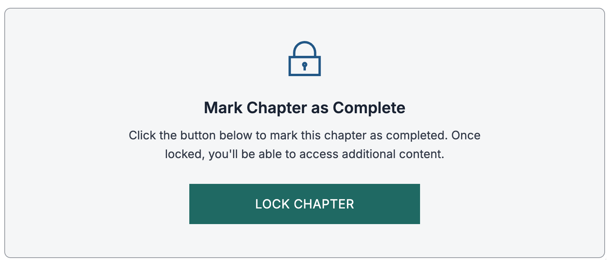
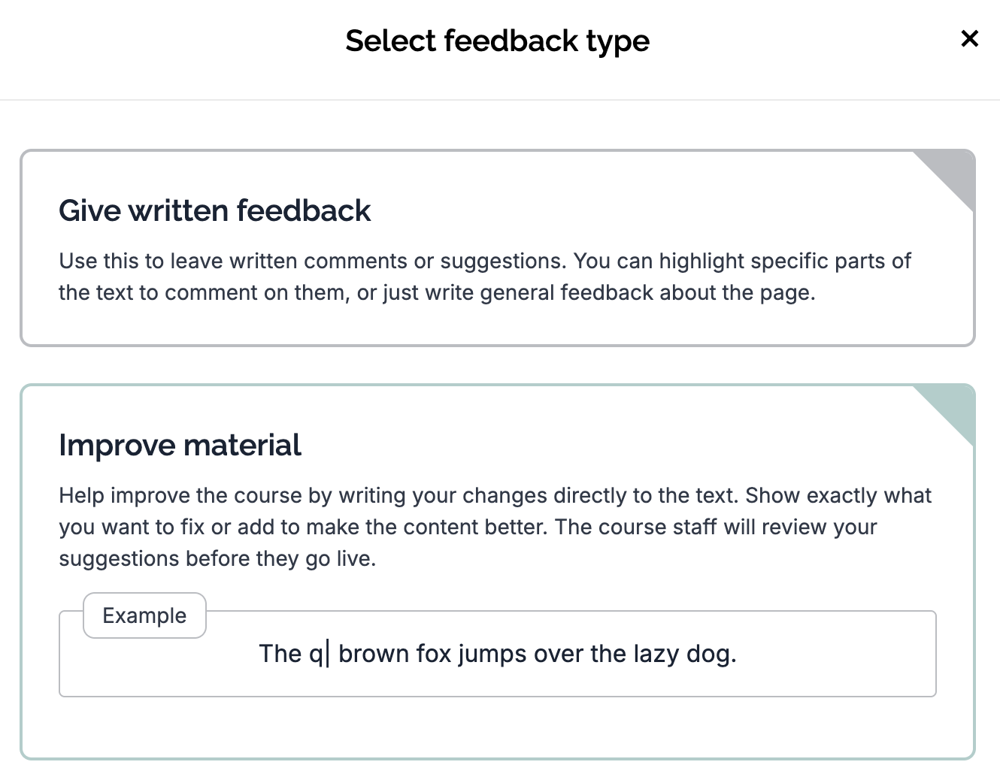

# Chapter 1: Getting Started

Source: https://courses.mooc.fi/org/uh-cs/courses/full-stack-open-graphql/chapter-1
Exported: 2026-08-27T10:29:32.646Z

In this part, we will explore GraphQL, a modern alternative to REST for implementing server interfaces. We will learn the core concepts of GraphQL, including schemas, queries, mutations, and subscriptions, and build a GraphQL server using Apollo Server. On the frontend, we will connect a React application to the GraphQL backend using Apollo Client, handling data fetching, caching, and state management. We will also add a database and user authentication to the backend, and finish by looking at advanced topics such as optimizing queries.

## Prerequisites

This part relies on core JavaScript and React skills from the earlier parts, as well as experience building server-side applications with Node.js. Before starting this part you should be comfortable with React component patterns, managing state, and making HTTP requests from the frontend. On the backend side, you should understand how to structure a Node.js application, connect to a database, and implement user authentication. It is recommended that you finish at least parts 0 to 5 before starting this part.

## Enrollment

You do not need to enroll to study in the course. You can enroll only after you have completed the course, see the Getting ECTS credits and the certificate below.

## Help with exercises or course practicalities

This course has a Discord group where we discuss everything about the course. Support is available almost 24/7, with the discussion being in both English and Finnish.

Join our Full stack open Discord channel: [https://study.cs.helsinki.fi/discord/join/fullstack](https://study.cs.helsinki.fi/discord/join/fullstack)

All inappropriate, degrading, or discriminatory comments on the channel are prohibited and will lead to action taken against the commenter.

## Submitting exercises

This course part contains 29 exercises, and most of them must be completed in order to receive a grade. Some of the tasks are optional, and the optionality is clearly marked in the course material.

The exercises are to be submitted to a new GitHub repository, which will include all of the source code and the configurations that you do during this part. If you are using a private repository, add the GitHub user mluukkai as a collaborator.

Your exercises are reviewed after you submit the last exercise, and if everything is more or less ok, you will be graded, and the certificate and university credits will be available to you.

> 

## Locking a chapter

Once you have finished all exercises in a chapter, you must lock the chapter before continuing to the next one. Keep in mind that after locking a chapter, you won’t be able to submit any further exercises for it, so only lock it when everything is done.

The Locking a chapter activity looks like this:

## Getting ECTS credits and the certificate

After you have completed the exercises and those are graded, you can get the ECTS credits as follows

Registering the credits takes usually two days.

The course certificate is available also at the course front page.

## Improvements and feedback to the course material

We welcome contributions to the course material from students and other members of the DevOps community! If you notice any mistakes, typos, or errors in the material, please consider submitting a correction or clarification request by pressing the Give feedback button, which gives you two choices:

In case of e.g., typos, it is preferable to select the Improve Material that makes the material "editable", and you may send the improvement suggestions for approval.

## Using LLM:s

Large language models have become powerful tools in software development, and coding agents push those capabilities even further. They can make a course like this feel almost effortless—but relying on them too heavily comes at a cost. To use AI effectively, you still need a solid command of the fundamentals. That’s why I suggest using agents in moderation, especially for explanations and debugging, so you build real understanding rather than outsourcing the learning.

A practical, learning-first approach to using AI on this course:

Before using AI

How to use AI wisely

What to avoid

Bottom line: let AI be your explainer, reviewer, and debugging partner—not your substitute for thinking and practice.

## About the material

This material is licensed under [Creative Commons BY-NC-SA 4.0](https://creativecommons.org/licenses/by-nc-sa/4.0/legalcode.en) -licence, so you can freely use and distribute the material, as long as the original creators are credited. If you make changes to the material and you want to distribute the altered version, it must be licensed under the same license. Usage of the material for commercial use is prohibited without permission.

## Exercise: 0. Warmup

Before the start, let us ensure that you have read the info on this page well enough.
