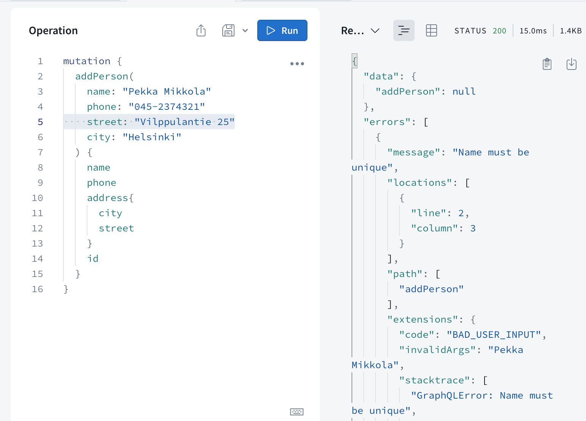
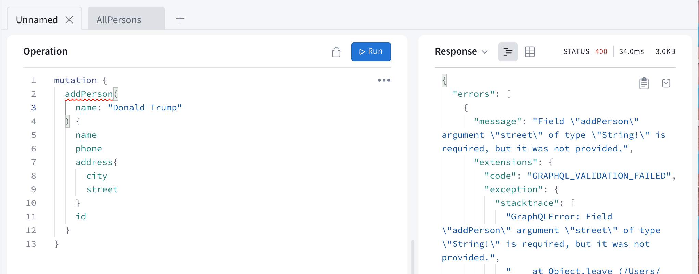

# Chapter 2: GraphQL server

Source: https://courses.mooc.fi/org/uh-cs/courses/full-stack-open-graphql/chapter-2
Exported: 2026-09-13T08:06:39.904Z

REST, familiar to us from the previous parts of the course, has long been the most prevalent way to implement the interfaces servers offer for browsers, and in general the integration between different applications on the web.

In recent years, [GraphQL](http://graphql.org/), developed by Facebook, has become popular for communication between web applications and servers.

The GraphQL philosophy is very different from REST. REST is resource-based. Every resource, for example a user, has its own address which identifies it, for example /users/10. All operations done to the resource are done with HTTP requests to its URL. The action depends on the HTTP method used.

The resource-basedness of REST works well in most situations. However, it can be a bit awkward sometimes.

Let's consider the following example: our bloglist application contains some kind of social media functionality, and we would like to show a list of all the blogs that were added by users who have commented on any of the blogs of the users we follow.

If the server implemented a REST API, we would probably have to do multiple HTTP requests from the browser before we had all the data we wanted. The requests would also return a lot of unnecessary data, and the code on the browser would probably be quite complicated.

If this was an often-used functionality, there could be a REST endpoint for it. If there were a lot of these kinds of scenarios however, it would become very laborious to implement REST endpoints for all of them.

A GraphQL server is well-suited for these kinds of situations.

The main principle of GraphQL is that the code on the browser forms a query describing the data wanted, and sends it to the API with an HTTP POST request. Unlike REST, all GraphQL queries are sent to the same address, and their type is POST.

The data described in the above scenario could be fetched with (roughly) the following query:

```
query FetchBlogsQuery {
  user(username: "mluukkai") {
    followedUsers {
      blogs {
        comments {
          user {
            blogs {
              title
            }
          }
        }
      }
    }
  }
}
```

The content of the `FetchBlogsQuery` can be roughly interpreted as: find a user named `"mluukkai"` and for each of his `followedUsers`, find all their `blogs`, and for each blog, all its `comments`, and for each `user` who wrote each comment, find their `blogs`, and return the `title` of each of them.

The server's response would be about the following JSON object:

```
{
  "data": {
    "followedUsers": [
      {
        "blogs": [
          {
            "comments": [
              {
                "user": {
                  "blogs": [
                    {
                      "title": "Goto considered harmful"
                    },
                    {
                      "title": "End to End Testing with Cypress is most enjoyable"
                    },
                    {
                      "title": "Navigating your transition to GraphQL"
                    },
                    {
                      "title": "From REST to GraphQL"
                    }
                  ]
                }
              }
            ]
          }
        ]
      }
    ]
  }
}
```

The application logic stays simple, and the code on the browser gets exactly the data it needs with a single query.

## Schemas and queries

We will get to know the basics of GraphQL by implementing a GraphQL version of the phonebook application from parts 2 and 3.

In the heart of all GraphQL applications is a [schema](https://graphql.org/learn/schema/), which describes the data sent between the client and the server. The initial schema for our phonebook is as follows:

```
type Person {
  name: String!
  phone: String
  street: String!
  city: String!
  id: ID! 
}

type Query {
  personCount: Int!
  allPersons: [Person!]!
  findPerson(name: String!): Person
}
```

The schema describes two [types](https://graphql.org/learn/schema/#type-system). The first type, Person, determines that persons have five fields. Four of the fields are type String, which is one of the [scalar types](https://graphql.org/learn/schema/#scalar-types) of GraphQL. All of the String fields, except phone, must be given a value. This is marked by the exclamation mark on the schema. The type of the field id is ID. ID fields are strings, but GraphQL ensures they are unique.

The second type is a [Query](https://graphql.org/learn/queries/). Practically every GraphQL schema describes a Query, which tells what kind of queries can be made to the API.

The phonebook describes three different queries. `personCount` returns an integer, `allPersons` returns a list of Person objects and findPerson is given a string parameter and it returns a Person object.

Again, exclamation marks are used to mark which return values and parameters are Non-Null. `personCount` will, for sure, return an integer. The query `findPerson` must be given a string as a parameter. The query returns a Person-object or null. `allPersons` returns a list of Person objects, and the list does not contain any null values.

So the schema describes what queries the client can send to the server, what kind of parameters the queries can have, and what kind of data the queries return.

The simplest of the queries, `personCount`, looks as follows:

```
query {
  personCount
}
```

Assuming our application has saved the information of three people, the response would look like this:

```
{
  "data": {
    "personCount": 3
  }
}
```

The query fetching the information of all of the people, `allPersons`, is a bit more complicated. Because the query returns a list of Person objects, the query must describe which [fields](https://graphql.org/learn/queries/#fields) of the objects the query returns:

```
query {
  allPersons {
    name
    phone
  }
}
```

The response could look like this:

```
{
  "data": {
    "allPersons": [
      {
        "name": "Arto Hellas",
        "phone": "040-123543"
      },
      {
        "name": "Matti Luukkainen",
        "phone": "040-432342"
      },
      {
        "name": "Venla Ruuska",
        "phone": null
      }
    ]
  }
}
```

A query can be made to return any field described in the schema. For example, the following would also be possible:

```
query {
  allPersons{
    name
    city
    street
  }
}
```

The last example shows a query which requires a parameter, and returns the details of one person.

```
query {
  findPerson(name: "Arto Hellas") {
    phone 
    city 
    street
    id
  }
}
```

So, first, the parameter is described in round brackets, and then the fields of the return value object are listed in curly brackets.

The response is like this:

```
{
  "data": {
    "findPerson": {
      "phone": "040-123543",
      "city": "Espoo",
      "street": "Tapiolankatu 5 A"
      "id": "3d594650-3436-11e9-bc57-8b80ba54c431"
    }
  }
}
```

The return value was marked as nullable, so if we search for the details of an unknown

```
query {
  findPerson(name: "Joe Biden") {
    phone 
  }
}
```

the return value is null.

```
{
  "data": {
    "findPerson": null
  }
}
```

As you can see, there is a direct link between a GraphQL query and the returned JSON object. One can think that the query describes what kind of data it wants as a response. The difference to REST queries is stark. With REST, the URL and the type of the request have nothing to do with the form of the returned data.

GraphQL query describes only the data moving between a server and the client. On the server, the data can be organized and saved any way we like.

Despite its name, GraphQL does not actually have anything to do with databases. It does not care how the data is saved. The data a GraphQL API uses can be saved into a relational database, document database, or to other servers which a GraphQL server can access with for example REST.

## Apollo Server

Let's implement a GraphQL server with today's leading library: [Apollo Server](https://www.apollographql.com/docs/apollo-server/).

Create a new npm project with `npm init` and install the required dependencies.

```
npm install @apollo/server graphql
```

Also create a `index.js` file in your project's root directory.

The initial code is as follows:

```
const { ApolloServer } = require('@apollo/server')
const { startStandaloneServer } = require('@apollo/server/standalone')

let persons = [
  {
    name: "Arto Hellas",
    phone: "040-123543",
    street: "Tapiolankatu 5 A",
    city: "Espoo",
    id: "3d594650-3436-11e9-bc57-8b80ba54c431"
  },
  {
    name: "Matti Luukkainen",
    phone: "040-432342",
    street: "Malminkaari 10 A",
    city: "Helsinki",
    id: '3d599470-3436-11e9-bc57-8b80ba54c431'
  },
  {
    name: "Venla Ruuska",
    street: "Nallemäentie 22 C",
    city: "Helsinki",
    id: '3d599471-3436-11e9-bc57-8b80ba54c431'
  },
]

const typeDefs = `
  type Person {
    name: String!
    phone: String
    street: String!
    city: String! 
    id: ID!
  }

  type Query {
    personCount: Int!
    allPersons: [Person!]!
    findPerson(name: String!): Person
  }
`

const resolvers = {
  Query: {
    personCount: () => persons.length,
    allPersons: () => persons,
    findPerson: (root, args) =>
      persons.find(p => p.name === args.name)
  }
}

const server = new ApolloServer({
  typeDefs,
  resolvers,
})

startStandaloneServer(server, {
  listen: { port: 4000 },
}).then(({ url }) => {
  console.log(`Server ready at ${url}`)
})
```

The heart of the code is an [ApolloServer](https://www.apollographql.com/docs/apollo-server/api/apollo-server/), which is given two parameters:

```
const server = new ApolloServer({
  typeDefs,
  resolvers,
})
```

The first parameter, `typeDefs`, contains the GraphQL schema.

The second parameter is an object, which contains the [resolvers](https://www.apollographql.com/docs/apollo-server/data/resolvers/) of the server. These are the code, which defines how GraphQL queries are responded to.

The code of the resolvers is the following:

```
const resolvers = {
  Query: {
    personCount: () => persons.length,
    allPersons: () => persons,
    findPerson: (root, args) =>
      persons.find(p => p.name === args.name)
  }
}
```

As you can see, the resolvers correspond to the queries described in the schema.

```
type Query {
  personCount: Int!
  allPersons: [Person!]!
  findPerson(name: String!): Person
}
```

So there is a field under Query for every query described in the schema.

The query

```
query {
  personCount
}
```

Has the resolver

```
() => persons.length
```

So the response to the query is the length of the array `persons`.

The query which fetches all persons

```
query {
  allPersons {
    name
  }
}
```

has a resolver which returns all objects from the `persons` array.

```
() => persons
```

## Apollo Studio Explorer

Let's add the following scripts to package.json to run the application:

```
{
  //...
  "scripts": {
    "start": "node index.js", // HIGHLIGHT LINE
    "dev": "node --watch index.js", // HIGHLIGHT LINE
    // ...
  }
}
```

When Apollo server is run in development mode the page [http://localhost:4000](http://localhost:4000/) takes us to [GraphOS Studio Explorer](https://www.apollographql.com/docs/graphos/platform/explorer). This is very useful for a developer, and can be used to make queries to the server.

Let's try it out:


At the left side Explorer shows the API-documentation that it has automatically generated based on the schema.

## Schema syntax highlighting in VS Code

The schema in our code is defined using template literal syntax:

```
const typeDefs = `
  type Person {
    name: String!
    phone: String
    street: String!
    city: String! 
    id: ID!
  }

  type Query {
    personCount: Int!
    allPersons: [Person!]!
    findPerson(name: String!): Person
  }
`
```

The schema contains structural information, but in the code editor the whole content appears in the same color and automatic formatting tools like Prettier cannot format its contents. We can enable GraphQL schema syntax highlighting and, for example, autocompletion in VS Code by installing the [GraphQL: Language Feature Support](https://marketplace.visualstudio.com/items?itemName=GraphQL.vscode-graphql) extension.

We need to somehow indicate to the extension that `typeDefs` contains GraphQL. There are several ways to do this. We'll do it now by adding the type-indicating comment `/* GraphQL */` before the template literal string:



Now the syntax highlighting works. The comment helps the installed extension recognize the string as GraphQL and provide intelligent editor features, but it does not affect the application's runtime. Prettier can now also format the schema.

### Parameters of a resolver

The query fetching a single person

```
query {
  findPerson(name: "Arto Hellas") {
    phone 
    city 
    street
  }
}
```

has a resolver which differs from the previous ones because it is given two parameters:

```
(root, args) => persons.find(p => p.name === args.name)
```

The second parameter, `args`, contains the parameters of the query. The resolver then returns from the array `persons` the person whose name is the same as the value of args.name. The resolver does not need the first parameter `root`.

In fact, all resolver functions are given [four parameters](https://www.graphql-tools.com/docs/resolvers#resolver-function-signature). With JavaScript, the parameters don't have to be defined if they are not needed. We will be using the first and the third parameter of a resolver later in this part.

## The default resolver

When we do a query, for example

```
query {
  findPerson(name: "Arto Hellas") {
    phone 
    city 
    street
  }
}
```

the server knows to send back exactly the fields required by the query. How does that happen?

A GraphQL server must define resolvers for each field of each type in the schema. We have so far only defined resolvers for fields of the type Query, so for each query of the application.

Because we did not define resolvers for the fields of the type Person, Apollo has defined [default resolvers](https://www.graphql-tools.com/docs/resolvers/#default-resolver) for them. They work like the one shown below:

```
const resolvers = {
  Query: {
    personCount: () => persons.length,
    allPersons: () => persons,
    findPerson: (root, args) => persons.find(p => p.name === args.name)
  },
  // BEGIN HIGHLIGHT
  Person: {
    name: (root) => root.name,
    phone: (root) => root.phone,
    street: (root) => root.street,
    city: (root) => root.city,
    id: (root) => root.id
  }
  // END HIGHLIGHT
}
```

The default resolver returns the value of the corresponding field of the object. The object itself can be accessed through the first parameter of the resolver, `root`.

If the functionality of the default resolver is enough, you don't need to define your own. It is also possible to define resolvers for only some fields of a type, and let the default resolvers handle the rest.

We could for example define that the address of all persons is Manhattan New York by hard-coding the following to the resolvers of the street and city fields of the type Person:

```
Person: {
  street: (root) => "Manhattan",
  city: (root) => "New York"
}
```

## Object within an object

Let's modify the schema a bit

```
// BEGIN HIGHLIGHT
type Address {
  street: String!
  city: String! 
}
  // END HIGHLIGHT

type Person {
  name: String!
  phone: String
  address: Address!   // HIGHLIGHT LINE
  id: ID!
}

type Query {
  personCount: Int!
  allPersons: [Person!]!
  findPerson(name: String!): Person
}
```

so a person now has a field with the type Address, which contains the street and the city.

Because the objects saved in the array do not have an address field, the default resolver is not sufficient. Let's add a resolver for the address field of Person type:

```
const resolvers = {
  Query: {
    personCount: () => persons.length,
    allPersons: () => persons,
    findPerson: (root, args) =>
      persons.find(p => p.name === args.name)
  },
  // BEGIN HIGHLIGHT
  Person: {
    address: (root) => {
      return { 
        street: root.street,
        city: root.city
      }
    }
  }
  // END HIGHLIGHT
}
```

So every time a Person object is returned, the fields name, phone and id are returned using their default resolvers, but the field address is formed by using a self-defined resolver. The parameter `root` of the resolver function is the person-object, so the street and the city of the address can be taken from its fields.

The queries requiring the address change into

```
query {
  findPerson(name: "Arto Hellas") {
    phone 
    address {
      city 
      street
    }
  }
}
```

and the response is now a person object, which contains an address object.

```
{
  "data": {
    "findPerson": {
      "phone": "040-123543",
      "address":  {
        "city": "Espoo",
        "street": "Tapiolankatu 5 A"
      }
    }
  }
}
```

We still save the persons in the server the same way we did before.

```
let persons = [
  {
    name: "Arto Hellas",
    phone: "040-123543",
    street: "Tapiolankatu 5 A",
    city: "Espoo",
    id: "3d594650-3436-11e9-bc57-8b80ba54c431"
  },
  // ...
]
```

The person-objects saved in the server are not exactly the same as the GraphQL type Person objects described in the schema.

Contrary to the Person type, the Address type does not have an id field, because they are not saved into their own separate data structure in the server.

Let's modify the resolver for the `address` field so that it destructures the needed fields from the parameter it receives:

```
const resolvers = {
  Query: {
    personCount: () => persons.length,
    allPersons: () => persons,
    findPerson: (root, args) => persons.find((p) => p.name === args.name),
  },
  Person: {
    address: ({ street, city }) => { // HIGHLIGHT LINE
      return {
        street, // HIGHLIGHT LINE
        city, // HIGHLIGHT LINE
      }
    },
  },
}
```

The current code of the application can be found on [Github](https://github.com/fullstack-hy2020/graphql-phonebook-backend/tree/part8-1), branch part8-1.

## Mutations

Let's add a functionality for adding new persons to the phonebook. In GraphQL, all operations which cause a change are done with [mutations](https://graphql.org/learn/mutations). Mutations are described in the schema as the keys of type Mutation.

The schema for a mutation for adding a new person looks as follows:

```
type Mutation {
  addPerson(
    name: String!
    phone: String
    street: String!
    city: String!
  ): Person
}
```

The Mutation is given the details of the person as parameters. The parameter phone is the only one which is nullable. The Mutation also has a return value. The return value is type Person, the idea being that the details of the added person are returned if the operation is successful and if not, null. Value for the field id is not given as a parameter. Generating an id is better left for the server.

Mutations also require a resolver:

```
const { v1: uuid } = require('uuid') // HIGHLIGHT LINE

// ...

const resolvers = {
  Query: {
    // ...
  },
  Person: {
    // ...
  },
  // BEGIN HIGHLIGHT
  Mutation: {
    addPerson: (root, args) => {
      const person = { ...args, id: uuid() }
      persons = persons.concat(person)
      return person
    }
  }
  // END HIGHLIGHT
}

// ...
```

The mutation adds the object given to it as a parameter `args` to the array `persons`, and returns the object it added to the array.

The id field is given a unique value using the [uuid](https://github.com/kelektiv/node-uuid#readme) library.

A new person can be added with the following mutation

```
mutation {
  addPerson(
    name: "Pekka Mikkola"
    phone: "045-2374321"
    street: "Vilppulantie 25"
    city: "Helsinki"
  ) {
    name
    phone
    address {
      city
      street
    }
    id
  }
}
```

Note that the person is saved to the `persons` array as

```
{
  name: "Pekka Mikkola",
  phone: "045-2374321",
  street: "Vilppulantie 25",
  city: "Helsinki",
  id: "2b24e0b0-343c-11e9-8c2a-cb57c2bf804f"
}
```

But the response to the mutation is

```
{
  "data": {
    "addPerson": {
      "name": "Pekka Mikkola",
      "phone": "045-2374321",
      "address": {
        "city": "Helsinki",
        "street": "Vilppulantie 25"
      },
      "id": "2b24e0b0-343c-11e9-8c2a-cb57c2bf804f"
    }
  }
}
```

So the resolver of the address field of the Person type formats the response object to the right form.

## Error handling

If we try to create a new person, but the parameters do not correspond with the schema description, the server gives an error message:



So some of the error handling can be automatically done with GraphQL [validation](https://graphql.org/learn/validation/).

However, GraphQL cannot handle everything automatically. For example, stricter rules for data sent to a Mutation have to be added manually. An error could be handled by throwing [GraphQLError](https://www.apollographql.com/docs/apollo-server/data/errors/#custom-errors) with a proper [error code](https://www.apollographql.com/docs/apollo-server/data/errors/#built-in-error-codes).

Let's prevent adding the same name to the phonebook multiple times:

```
const { GraphQLError } = require('graphql') // HIGHLIGHT LINE

// ...

const resolvers = {
  // ..
  Mutation: {
    addPerson: (root, args) => {
      // BEGIN HIGHLIGHT
      if (persons.find(p => p.name === args.name)) {
        throw new GraphQLError(`Name must be unique: ${args.name}`, {
          extensions: {
            code: 'BAD_USER_INPUT',
            invalidArgs: args.name
          }
        })
      }
      // END HIGHLIGHT

      const person = { ...args, id: uuid() }
      persons = persons.concat(person)
      return person
    }
  }
}
```

So if the name to be added already exists in the phonebook, throw `GraphQLError` error.


The current code of the application can be found on [GitHub](https://github.com/fullstack-hy2020/graphql-phonebook-backend/tree/part8-2), branch part8-2.

## Enum

Let's add a possibility to filter the query returning all persons with the parameter phone so that it returns only persons with a phone number

```
query {
  allPersons(phone: YES) {
    name
    phone 
  }
}
```

or persons without a phone number

```
query {
  allPersons(phone: NO) {
    name
  }
}
```

The schema changes like so:

```
// BEGIN HIGHLIGHT
enum YesNo {
  YES
  NO
}
// END HIGHLIGHT

type Query {
  personCount: Int!
  allPersons(phone: YesNo): [Person!]! // HIGHLIGHT LINE
  findPerson(name: String!): Person
}
```

The type YesNo is a GraphQL [enum](https://graphql.org/learn/schema/#enumeration-types), or an enumerable, with two possible values: YES or NO. In the query `allPersons`, the parameter `phone` has the type YesNo, but is nullable.

The resolver changes like so:

```
Query: {
  personCount: () => persons.length,
  // BEGIN HIGHLIGHT
  allPersons: (root, args) => {
    if (!args.phone) {
      return persons
    }

    const byPhone = (person) =>
      args.phone === 'YES' ? person.phone : !person.phone

    return persons.filter(byPhone)
  },
  // END HIGHLIGHT
  findPerson: (root, args) =>
    persons.find(p => p.name === args.name)
},
```

## Changing a phone number

Let's add a mutation for changing the phone number of a person. The schema of this mutation looks as follows:

```
type Mutation {
  addPerson(
    name: String!
    phone: String
    street: String!
    city: String!
  ): Person
  // BEGIN HIGHLIGHT
  editNumber(
    name: String!
    phone: String!
  ): Person
  // END HIGHLIGHT
}
```

and is done by a resolver:

```
Mutation: {
  // ...
  editNumber: (root, args) => {
    const person = persons.find(p => p.name === args.name)
    if (!person) {
      return null
    }

    const updatedPerson = { ...person, phone: args.phone }
    persons = persons.map(p => p.name === args.name ? updatedPerson : p)
    return updatedPerson
  }   
}
```

The mutation finds the person to be updated by the field name.

The current code of the application can be found on [Github](https://github.com/fullstack-hy2020/graphql-phonebook-backend/tree/part8-3), branch part8-3.

## More on queries

With GraphQL, it is possible to combine multiple fields of type Query, or "separate queries" into one query. For example, the following query returns both the amount of persons in the phonebook and their names:

```
query {
  personCount
  allPersons {
    name
  }
}
```

The response looks as follows:

```
{
  "data": {
    "personCount": 3,
    "allPersons": [
      {
        "name": "Arto Hellas"
      },
      {
        "name": "Matti Luukkainen"
      },
      {
        "name": "Venla Ruuska"
      }
    ]
  }
}
```

Combined query can also use the same query multiple times. You must however give the queries alternative names like so:

```
query {
  havePhone: allPersons(phone: YES){
    name
  }
  phoneless: allPersons(phone: NO){
    name
  }
}
```

The response looks like:

```
{
  "data": {
    "havePhone": [
      {
        "name": "Arto Hellas"
      },
      {
        "name": "Matti Luukkainen"
      }
    ],
    "phoneless": [
      {
        "name": "Venla Ruuska"
      }
    ]
  }
}
```

In some cases, it might be beneficial to name the queries. This is the case especially when the queries or mutations have [parameters](https://graphql.org/learn/queries/#variables). We will get into parameters soon.

## Exercise: 1. The number of books and authors

Initial setup

Create a new GitHub repository for the part8 exercises. If you are using a private repository, add the GitHub user mluukkai as a collaborator.

Next, copy the contents of the repository [https://github.com/fullstack-hy2020/fs-graphql](https://github.com/fullstack-hy2020/fs-graphql) to your repository root. After this, your repository's folder structure should look like this:

```
├── .github/
├── library-backend/
├── library-frontend/
├── tests-chapter4/
├── tests-chapter5/
```

You should not alter this directory structure, so there should be these directories in the root of your submission repository.

In this chapter’s exercises, we will implement a GraphQL backend for a small library. The application base can be found in the library-backend folder. Remember to install the dependencies with the command `npm install`.

Task

Implement queries `bookCount` and `authorCount` which return the number of books and the number of authors.

The query

```
query {
  bookCount
  authorCount
}
```

should return

```
{
  "data": {
    "bookCount": 7,
    "authorCount": 5
  }
}
```

## Exercise: 2. All books

Implement query `allBooks`, which returns the details of all books.

In the end, the user should be able to do the following query:

```
query {
  allBooks { 
    title 
    author
    published 
    genres
  }
}
```

## Exercise: 3. All authors

Implement query `allAuthors`, which returns the details of all authors. The response should include a field `bookCount` containing the number of books the author has written.

For example the query

```
query {
  allAuthors {
    name
    bookCount
  }
}
```

should return

```
{
  "data": {
    "allAuthors": [
      {
        "name": "Robert Martin",
        "bookCount": 2
      },
      {
        "name": "Martin Fowler",
        "bookCount": 1
      },
      {
        "name": "Fyodor Dostoevsky",
        "bookCount": 2
      },
      {
        "name": "Joshua Kerievsky",
        "bookCount": 1
      },
      {
        "name": "Sandi Metz",
        "bookCount": 1
      }
    ]
  }
}
```

## Exercise: 4. Books of an author

Modify the `allBooks` query so that a user can give an optional parameter author. The response should include only books written by that author.

For example query

```
query {
  allBooks(author: "Robert Martin") {
    title
  }
}
```

should return

```
{
  "data": {
    "allBooks": [
      {
        "title": "Clean Code"
      },
      {
        "title": "Agile software development"
      }
    ]
  }
}
```

## Exercise: 5. Books by genre

Modify the query `allBooks` so that a user can give an optional parameter genre. The response should include only books of that genre.

For example query

```
query {
  allBooks(genre: "refactoring") {
    title
    author
  }
}
```

should return

```
{
  "data": {
    "allBooks": [
      {
        "title": "Clean Code",
        "author": "Robert Martin"
      },
      {
        "title": "Refactoring, edition 2",
        "author": "Martin Fowler"
      },
      {
        "title": "Refactoring to patterns",
        "author": "Joshua Kerievsky"
      },
      {
        "title": "Practical Object-Oriented Design, An Agile Primer Using Ruby",
        "author": "Sandi Metz"
      }
    ]
  }
}
```

The query must work when both optional parameters are given:

```
query {
  allBooks(author: "Robert Martin", genre: "refactoring") {
    title
    author
  }
}
```

## Exercise: 6. Adding a book

Implement mutation `addBook`, which can be used like this:

```
mutation {
  addBook(
    title: "NoSQL Distilled",
    author: "Martin Fowler",
    published: 2012,
    genres: ["database", "nosql"]
  ) {
    title,
    author
  }
}
```

The mutation works even if the author is not already saved to the server:

```
mutation {
  addBook(
    title: "Pimeyden tango",
    author: "Reijo Mäki",
    published: 1997,
    genres: ["crime"]
  ) {
    title,
    author
  }
}
```

If the author is not yet saved to the server, a new author is added to the system. The birth years of authors are not saved to the server yet, so the query

```
query {
  allAuthors {
    name
    born
    bookCount
  }
}
```

returns

```
{
  "data": {
    "allAuthors": [
      // ...
      {
        "name": "Reijo Mäki",
        "born": null,
        "bookCount": 1
      }
    ]
  }
}
```

## Exercise: 7. Updating the birth year of an author

Implement mutation `editAuthor`, which can be used to set a birth year for an author. The mutation is used like so:

```
mutation {
  editAuthor(name: "Reijo Mäki", setBornTo: 1958) {
    name
    born
  }
}
```

If the correct author is found, the operation returns the edited author:

```
{
  "data": {
    "editAuthor": {
      "name": "Reijo Mäki",
      "born": 1958
    }
  }
}
```

If the author is not in the system, null is returned:

```
{
  "data": {
    "editAuthor": null
  }
}
```
