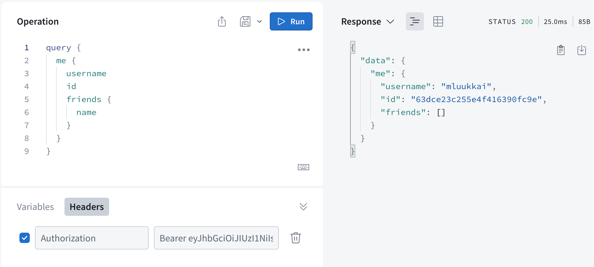

# Chapter 4: Database and user administration

Source: https://courses.mooc.fi/org/uh-cs/courses/full-stack-open-graphql/chapter-4
Exported: 2026-08-27T10:29:32.646Z

In this chapter, we’ll start using a database to store data and extend the application with user management. First, however, we’ll refactor the backend code. The current code for the phonebook backend can be found on [GitHub](https://github.com/fullstack-hy2020/graphql-phonebook-backend/tree/part8-3) in the part8-3 branch.

## Refactoring the backend

So far, we’ve written all the code in the index.js file. As the application grows, this is no longer sensible: as the file gets longer, its readability and comprehensibility suffer. It’s also good programming practice to separate different responsibilities of the application into their own modules.

Let’s now refactor the backend by splitting it into multiple files.

We’ll start by extracting the application’s GraphQL schema into a file called schema.js:

```
const typeDefs = /* GraphQL */ `
  type Address {
    street: String!
    city: String!
  }

  type Person {
    name: String!
    phone: String
    address: Address!
    id: ID!
  }

  enum YesNo {
    YES
    NO
  }

  type Query {
    personCount: Int!
    allPersons(phone: YesNo): [Person!]!
    findPerson(name: String!): Person
  }

  type Mutation {
    addPerson(
      name: String!
      phone: String
      street: String!
      city: String!
    ): Person
    editNumber(name: String!, phone: String!): Person
  }
`

module.exports = typeDefs
```

Next, we’ll move the code responsible for the resolvers into its own module, resolvers.js:

```
const { GraphQLError } = require('graphql')
const { v1: uuid } = require('uuid')

let persons = [
  {
    name: 'Arto Hellas',
    phone: '040-123543',
    street: 'Tapiolankatu 5 A',
    city: 'Espoo',
    id: '3d594650-3436-11e9-bc57-8b80ba54c431',
  },
  {
    name: 'Matti Luukkainen',
    phone: '040-432342',
    street: 'Malminkaari 10 A',
    city: 'Helsinki',
    id: '3d599470-3436-11e9-bc57-8b80ba54c431',
  },
  {
    name: 'Venla Ruuska',
    street: 'Nallemäentie 22 C',
    city: 'Helsinki',
    id: '3d599471-3436-11e9-bc57-8b80ba54c431',
  },
]

const resolvers = {
  Query: {
    personCount: () => persons.length,
    allPersons: (root, args) => {
      if (!args.phone) {
        return persons
      }
      const byPhone = (person) =>
        args.phone === 'YES' ? person.phone : !person.phone
      return persons.filter(byPhone)
    },
    findPerson: (root, args) => persons.find((p) => p.name === args.name),
  },
  Person: {
    address: ({ street, city }) => {
      return {
        street,
        city,
      }
    },
  },
  Mutation: {
    addPerson: (root, args) => {
      if (persons.find((p) => p.name === args.name)) {
        throw new GraphQLError(`Name must be unique: ${args.name}`, {
          extensions: {
            code: 'BAD_USER_INPUT',
            invalidArgs: args.name,
          },
        })
      }

      const person = { ...args, id: uuid() }
      persons = persons.concat(person)
      return person
    },
    editNumber: (root, args) => {
      const person = persons.find((p) => p.name === args.name)
      if (!person) {
        return null
      }

      const updatedPerson = { ...person, phone: args.phone }
      persons = persons.map((p) => (p.name === args.name ? updatedPerson : p))
      return updatedPerson
    },
  },
}

module.exports = resolvers
```

For simplicity, the persons array that holds the people’s data is now placed in the same file as the resolvers. The array will soon be removed when we switch to using a database for storing data.

Finally, we’ll also move the code responsible for starting the Apollo server into its own file, server.js:

```
const { ApolloServer } = require('@apollo/server')
const { startStandaloneServer } = require('@apollo/server/standalone')

const resolvers = require('./resolvers')
const typeDefs = require('./schema')

const startServer = (port) => {
  const server = new ApolloServer({
    typeDefs,
    resolvers,
  })

  startStandaloneServer(server, {
    listen: { port },
  }).then(({ url }) => {
    console.log(`Server ready at ${url}`)
  })
}

module.exports = startServer
```

Starting the Apollo server is now handled inside the startServer function we defined ourselves. This lets us export the function and start the server from outside the module, from the index.js file. The function takes as a parameter the port that Apollo Server will listen on.

Let’s install the dotenv library so that we can define environment variables in a .env file:

```
npm install dotenv
```

Only a small amount of code remains in index.js. After the refactor, its contents are as follows:

```
require('dotenv').config()

const startServer = require('./server')

const PORT = process.env.PORT || 4000

startServer(PORT)
```

Environment variables are first read from the .env file using the dotenv library. The port to use is now read from an environment variable, if one is set. If the PORT environment variable is not found, the default port 4000 is used—which is also the port the frontend currently expects the server to be running on. Finally, Apollo Server is started by calling the function startServer.

For now, the contents of index.js are just a stub, but as the application grows it will include more. For example, when we soon switch to using a database for storing data, the database connection must be created before starting the server.

The responsibilities of the application are now clearly separated:

## Mongoose and Apollo

Let’s now start using a MongoDB database in our application. We’ll introduce the database by following the approach used in parts [3](https://fullstackopen.com/en/part3/saving_data_to_mongo_db) and [4](https://fullstackopen.com/en/part4/structure_of_backend_application_introduction_to_testing).

Install Mongoose:

```
npm install mongoose
```

Define the person schema in the file models/person.js as follows:

```
const mongoose = require('mongoose')

const schema = new mongoose.Schema({
  name: {
    type: String,
    required: true,
    minlength: 5
  },
  phone: {
    type: String,
    minlength: 5
  },
  street: {
    type: String,
    required: true,
    minlength: 5
  },
  city: {
    type: String,
    required: true,
    minlength: 3
  },
})

module.exports = mongoose.model('Person', schema)
```

We also included a few validations. `required: true`, which makes sure that a value exists, is actually redundant: we already ensure that the fields exist with GraphQL. However, it is good to also keep validation in the database.

Let’s create a separate module db.js for the code that establishes the database connection:

```
const mongoose = require('mongoose')

const connectToDatabase = async (uri) => {
  console.log('connecting to database URI:', uri)

  try {
    await mongoose.connect(uri)
    console.log('connected to MongoDB')
  } catch (error) {
    console.log('error connection to MongoDB:', error.message)
    process.exit(1)
  }
}

module.exports = connectToDatabase
```

The module defines the function `connectToDatabase`, which receives the database URI as a parameter and takes care of connecting to the database.

Let’s use the module in the file index.js:

```
require('dotenv').config()

const connectToDatabase = require('./db') // HIGHLIGHT LINE
const startServer = require('./server')

const MONGODB_URI = process.env.MONGODB_URI // HIGHLIGHT LINE
const PORT = process.env.PORT || 4000

const main = async () => { // HIGHLIGHT LINE
  await connectToDatabase(MONGODB_URI) // HIGHLIGHT LINE
  startServer(PORT)
}

main()
```

Because the async/await syntax can only be used inside functions, we now define a simple main function that handles starting the application. This allows us to call the function that creates the database connection using the await keyword.

The value of `MONGODB_URI` is obtained from an environment variable, so you need to add an appropriate value for it to the .env file in the same way as in [part 3](https://fullstackopen.com/en/part3/saving_data_to_mongo_db#defining-environment-variables-using-the-dotenv-library). The application first calls the function that creates the database connection, and once the database connection has been successfully established, it starts the GraphQL server.

The contents of resolvers.js, which is responsible for the application logic, will change almost completely. We can get the application to work largely by making the following changes:

```
const { GraphQLError } = require('graphql')
const Person = require('./models/person')

const resolvers = {
  Query: {
    personCount: async () => Person.collection.countDocuments(),
    allPersons: async (root, args) => {
      // filters missing
      return Person.find({})
    },
    findPerson: async (root, args) => Person.findOne({ name: args.name }),
  },
  Person: {
    address: ({ street, city }) => {
      return {
        street,
        city,
      }
    },
  },
  Mutation: {
    addPerson: async (root, args) => {
      const nameExists = await Person.exists({ name: args.name })

      if (nameExists) {
        throw new GraphQLError(`Name must be unique: ${args.name}`, {
          extensions: {
            code: 'BAD_USER_INPUT',
            invalidArgs: args.name,
          },
        })
      }

      const person = new Person({ ...args })
      return person.save()
    },
    editNumber: async (root, args) => {
      const person = await Person.findOne({ name: args.name })

      if (!person) {
        return null
      }

      person.phone = args.phone
      return person.save()
    },
  },
}

module.exports = resolvers
```

The changes are pretty straightforward. However, there are a few noteworthy things. As we remember, in Mongo, the identifying field of an object is called _id and we previously had to parse the name of the field to id ourselves. Now GraphQL can do this automatically.

Another noteworthy thing is that the resolver functions now return a promise, when they previously returned normal objects. When a resolver returns a promise, Apollo server [sends back](https://www.apollographql.com/docs/apollo-server/data/resolvers#return-values) the value which the promise resolves to.

For example, if the following resolver function is executed,

```
allPersons: async (root, args) => {
  return Person.find({})
},
```

Apollo server waits for the promise to resolve, and returns the result. So Apollo works roughly like this:

```
allPersons: async (root, args) => {
  const result = await Person.find({})
  return result
}
```

Let's complete the `allPersons` resolver so it takes the optional parameter `phone` into account:

```
Query: {
  // ..
  allPersons: async (root, args) => {
    if (!args.phone) {
      return Person.find({})
    }

    return Person.find({ phone: { $exists: args.phone === 'YES' } })
  },
},
```

So if the query has not been given a parameter `phone`, all persons are returned. If the parameter has the value YES, the result of the query

```
Person.find({ phone: { $exists: true }})
```

is returned, so the objects in which the field `phone` has a value. If the parameter has the value NO, the query returns the objects in which the `phone` field has no value:

```
Person.find({ phone: { $exists: false }})
```

## Validation

As well as in GraphQL, the input is now validated using the validations defined in the mongoose schema. For handling possible validation errors in the schema, we must add an error-handling `try/catch` block to the `save` method. When we end up in the catch, we throw an exception [GraphQLError](https://www.apollographql.com/docs/apollo-server/data/errors/#custom-errors) with error code :

```
Mutation: {
  addPerson: async (root, args) => {
      const nameExists = await Person.exists({ name: args.name })

      if (nameExists) {
        throw new GraphQLError(`Name must be unique: ${args.name}`, {
          extensions: {
            code: 'BAD_USER_INPUT',
            invalidArgs: args.name,
          },
        })
      }

      const person = new Person({ ...args })

// BEGIN HIGHLIGHT
      try {
        await person.save()
      } catch (error) {
        throw new GraphQLError(`Saving person failed: ${error.message}`, {
          extensions: {
            code: 'BAD_USER_INPUT',
            invalidArgs: args.name,
            error
          }
        })
      }
 
      return person
// END HIGHLIGHT
  },
    editNumber: async (root, args) => {
      const person = await Person.findOne({ name: args.name })

      if (!person) {
        return null
      }

      person.phone = args.phone

// BEGIN HIGHLIGHT
      try {
        await person.save()
      } catch (error) {
        throw new GraphQLError(`Saving number failed: ${error.message}`, {
          extensions: {
            code: 'BAD_USER_INPUT',
            invalidArgs: args.name,
            error
          }
        })
      }
 
      return person
// END HIGHLIGHT
    }
}
```

We have also added the Mongoose error and the data that caused the error to the extensions object that is used to convey more info about the cause of the error to the caller. The frontend can then display this information to the user, who can try the operation again with a better input.

The code of the backend can be found on [Github](https://github.com/fullstack-hy2020/graphql-phonebook-backend/tree/part8-4), branch part8-4.

### User and log in

Let's add user management to our application. For simplicity's sake, let's assume that all users have the same password which is hardcoded to the system. It would be straightforward to save individual passwords for all users following the principles from [part 4](https://fullstackopen.com/en/part4/user_administration), but because our focus is on GraphQL, we will leave out all that extra hassle this time.

Let’s create the user schema in the file models/user.js:

```
const mongoose = require('mongoose')

const schema = new mongoose.Schema({
  username: {
    type: String,
    required: true,
    minlength: 3
  },
  friends: [
    {
      type: mongoose.Schema.Types.ObjectId,
      ref: 'Person'
    }
  ],
})

module.exports = mongoose.model('User', schema)
```

Every user is connected to a bunch of other persons in the system through the `friends` field. The idea is that when a user, e.g. mluukkai, adds a person, e.g. Arto Hellas, to the list, the person is added to their `friends` list. This way, logged-in users can have their own personalized view in the application.

Logging in and identifying the user are handled the same way we used in [part 4](https://fullstackopen.com/en/part4/token_authentication) when we used REST, by using tokens.

Let's extend the GraphQL schema like so:

```
type User {
  username: String!
  friends: [Person!]!
  id: ID!
}

type Token {
  value: String!
}

type Query {
  // ..
  me: User
}

type Mutation {
  // ...
  createUser(username: String!): User
  login(username: String!, password: String!): Token
}
```

The query `me` returns the currently logged-in user. New users are created with the `createUser` mutation, and logging in happens with the `login` mutation.

Let’s install the jsonwebtoken library:

```
npm install jsonwebtoken
```

The resolvers of the new mutations are as follows:

```
const jwt = require('jsonwebtoken')
const User = require('./models/user')

Mutation: {
  // ..
  createUser: async (root, args) => {
    const user = new User({ username: args.username })

    return user.save()
      .catch(error => {
        throw new GraphQLError(`Creating the user failed: ${error.message}`, {
          extensions: {
            code: 'BAD_USER_INPUT',
            invalidArgs: args.username,
            error
          }
        })
      })
  },
  login: async (root, args) => {
    const user = await User.findOne({ username: args.username })

    if ( !user || args.password !== 'secret' ) {
      throw new GraphQLError('wrong credentials', {
        extensions: {
          code: 'BAD_USER_INPUT'
        }
      })        
    }

    const userForToken = {
      username: user.username,
      id: user._id,
    }

    return { value: jwt.sign(userForToken, process.env.JWT_SECRET) }
  },
},
```

The new user mutation is straightforward. The login mutation checks if the username/password pair is valid. And if it is indeed valid, it returns a jwt token familiar from [part 4](https://fullstackopen.com/en/part4/token_authentication). Note that the `JWT_SECRET` must be defined in the .env file.

User creation is done now as follows:

```
mutation {
  createUser (
    username: "mluukkai"
  ) {
    username
    id
  }
}
```

The mutation for logging in looks like this:

```
mutation {
  login (
    username: "mluukkai"
    password: "secret"
  ) {
    value
  }
}
```

Just like in the previous case with REST, the idea now is that a logged-in user adds a token they receive upon login to all of their requests. And just like with REST, the token is added to GraphQL queries using the Authorization header.

In the Apollo Explorer, the header is added to a query like so:


On the backend, the most convenient way to pass the token that arrives with the request to the resolvers is to use Apollo Server’s [context](https://www.apollographql.com/docs/apollo-server/data/context/). With the context, we can perform things that are common to all queries and mutations, for example [identifying the user](https://www.apollographql.com/blog/authorization-in-graphql/) associated with the request.

Let’s change the backend startup so that the object passed as the second parameter to the [startStandaloneServer](https://www.apollographql.com/docs/apollo-server/api/standalone/) function includes a [context](https://www.apollographql.com/docs/apollo-server/data/context/) field, and let’s create a helper function `getUserFromAuthHeader` to verify the validity of the token and to find the user from the database:

```
const { ApolloServer } = require('@apollo/server')
const { startStandaloneServer } = require('@apollo/server/standalone')
const jwt = require('jsonwebtoken') // HIGHLIGHT LINE

const resolvers = require('./resolvers')
const typeDefs = require('./schema')
const User = require('./models/user') // HIGHLIGHT LINE

// BEGIN HIGHLIGHT
const getUserFromAuthHeader = async (auth) => {
  if (!auth || !auth.startsWith('Bearer ')) {
    return null
  }
 
  const decodedToken = jwt.verify(auth.substring(7), process.env.JWT_SECRET)
  return User.findById(decodedToken.id).populate('friends')
}
// END HIGHLIGHT

const startServer = (port) => {
  const server = new ApolloServer({
    typeDefs,
    resolvers,
  })

  startStandaloneServer(server, {
    listen: { port },
    // BEGIN HIGHLIGHT
    context: async ({ req }) => {
      const auth = req.headers.authorization
      const currentUser = await getUserFromAuthHeader(auth)
      return { currentUser }
    },
    // END HIGHLIGHT
  }).then(({ url }) => {
    console.log(`Server ready at ${url}`)
  })
}

module.exports = startServer
```

So the code we defined first extracts the token contained in the request’s `Authorization` header. The helper function `getUserFromAuthHeader` decodes the token and looks up the corresponding user from the database. If the token is not valid or the user cannot be found, the function returns `null`.

Finally, the context field `currentUser` is set to the user object corresponding to the requester, or to `null` if no user was found:

```
context: async ({ req }) => {
  const auth = req.headers.authorization
  const currentUser = await getUserFromAuthHeader(auth)
  return { currentUser } // HIGHLIGHT LINE
},
```

The context value is passed to resolvers as the `third parameter`. The resolver for the `me` query is very simple: it only returns the currently logged-in user, which it gets from the resolver parameter `context`, from the field `currentUser`:

```
Query: {
  // ...
  me: (root, args, context) => {
    return context.currentUser
  }
},
```

If the header contains a valid token, the query returns the details of the user identified by the token.



## Friends list

Let's complete the application's backend so that adding and editing persons requires logging in, and added persons are automatically added to the friends list of the user.

Let's first remove all persons not in anyone's friends list from the database.

`addPerson` mutation changes like so:

```
Mutation: {
  // BEGIN HIGHLIGHT
  addPerson: async (root, args, context) => {
    const currentUser = context.currentUser
 
    if (!currentUser) {
      throw new GraphQLError('not authenticated', {
        extensions: {
          code: 'UNAUTHENTICATED',
        }
      })
    }
    // END HIGHLIGHT

    const nameExists = await Person.exists({ name: args.name })

    if (nameExists) {
      throw new GraphQLError(`Name must be unique: ${args.name}`, {
        extensions: {
          code: 'BAD_USER_INPUT',
          invalidArgs: args.name,
        },
      })
    }

    const person = new Person({ ...args })

    try {
      await person.save()
      currentUser.friends = currentUser.friends.concat(person) // HIGHLIGHT LINE
      await currentUser.save() // HIGHLIGHT LINE
    } catch (error) {
      throw new GraphQLError(`Saving person failed: ${error.message}`, {
        extensions: {
          code: 'BAD_USER_INPUT',
          invalidArgs: args.name,
          error
        }
      })
    }

    return person
  },
  //...
}
```

If a logged-in user cannot be found from the context, an `GraphQLError` with a proper message is thrown. Creating new persons is now done with `async/await` syntax, because if the operation is successful, the created person is added to the friends list of the user.

Let’s also add the ability to add a person to your own friends list. The mutation schema is as follows:

```
type Mutation {
  // ...
  addAsFriend(name: String!): User // HIGHLIGHT LINE
}
```

And the mutation's resolver:

```
addAsFriend: async (root, args, { currentUser }) => {
    if (!currentUser) {
      throw new GraphQLError('not authenticated', {
        extensions: { code: 'UNAUTHENTICATED' },
      })
    }

    const nonFriendAlready = (person) =>
      !currentUser.friends
        .map((f) => f._id.toString())
        .includes(person._id.toString())

    const person = await Person.findOne({ name: args.name })

    if (!person) {
      throw new GraphQLError("The name didn't found", {
        extensions: {
          code: 'BAD_USER_INPUT',
          invalidArgs: args.name,
        },
      })
    }

    if (nonFriendAlready(person)) {
      currentUser.friends = currentUser.friends.concat(person)
    }

    await currentUser.save()

    return currentUser
  },
```

Note how the resolver destructures the logged-in user from the context. So instead of saving `currentUser` to a separate variable in a function

```
addAsFriend: async (root, args, context) => {
  const currentUser = context.currentUser
```

it is received straight in the parameter definition of the function:

```
addAsFriend: async (root, args, { currentUser }) => {
```

The following query now returns the user's friends list:

```
query {
  me {
    username
    friends{
      name
      phone
    }
  }
}
```

The code of the backend can be found on [Github](https://github.com/fullstack-hy2020/graphql-phonebook-backend/tree/part8-5) branch part8-5.

## Exercise: 13. Database, part 1

The following exercises are quite likely to break your frontend. Do not worry about it yet; the frontend shall be fixed and expanded in the next chapter.

Refactor the library application code into multiple files in the same way as at the beginning of this chapter. Proceed in small steps and keep the application working at all times. You can, for example, use the frontend to verify that all features still work after the refactoring.

Then modify the application so that it stores the data in a database. You can find the mongoose schema for books and authors from [here](https://github.com/fullstack-hy2020/misc/blob/master/library-schema.md).

Let's change the book graphql schema a little

```
type Book {
  title: String!
  published: Int!
  author: Author! // HIGHLIGHT LINE
  genres: [String!]!
  id: ID!
}
```

so that instead of just the author's name, the book object contains all the details of the author.

You can assume that the user will not try to add faulty books or authors, so you don't have to care about validation errors.

The following things do not have to work just yet:

Note: despite the fact that author is now an object within a book, the schema for adding a book can remain same, only the name of the author is given as a parameter

```
type Mutation {
  addBook(
    title: String!
    author: String! // HIGHLIGHT LINE
    published: Int!
    genres: [String!]!
  ): Book!
  editAuthor(name: String!, setBornTo: Int!): Author
}
```

## Exercise: 14. Database, part 2

Complete the program so that all queries (to get `allBooks` working with the parameter `author` and `bookCount` field of an author object is not required) and mutations work.

Regarding the genre parameter of the all books query, the situation is a bit more challenging. The solution is simple, but finding it can be a headache. You might benefit from [this](https://www.mongodb.com/docs/manual/tutorial/query-arrays/).

## Exercise: 15. Database, part 3

Complete the program so that database validation errors (e.g. book title or author name being too short) are handled sensibly. This means that they cause [GraphQLError](https://www.apollographql.com/docs/apollo-server/data/errors/#custom-errors) with a suitable error message to be thrown.

## Exercise: 16. User and logging in

Add user management to your application. Expand the schema like so:

```
type User {
  username: String!
  favoriteGenre: String!
  id: ID!
}

type Token {
  value: String!
}

type Query {
  // ..
  me: User
}

type Mutation {
  // ...
  createUser(
    username: String!
    favoriteGenre: String!
  ): User
  login(
    username: String!
    password: String!
  ): Token
}
```

Create resolvers for query `me` and the new mutations `createUser` and `login`. Like in the course material, you can assume all users have the same hardcoded password.

Make the mutations `addBook` and `editAuthor` possible only if the request includes a valid token.

(Don't worry about fixing the frontend for the moment.)

## Exercise: 17. Checkup

In this exercise, you will run automated tests that ensure your application works as expected and implements the requirements from previous exercises.

Preliminary Steps

Let's add a `_resetDatabase` mutation to the backend so the database can be initialized before tests. Add a new mutation to the schema.js file:

```
type Mutation {
    // ...
    _resetDatabase: Boolean  // HIGHLIGHT LINE
  }
```

Then add the corresponding resolver to the resolvers.js file:

```
const resolvers = {
  // ...
  Mutation: {
    // ...
    // BEGIN HIGHLIGHT
    _resetDatabase: async () => {
      if (process.env.NODE_ENV !== 'test') {
        throw new GraphQLError('_resetDatabase is only available in test mode')
      }
      await Author.deleteMany({})
      await Book.deleteMany({})
      await User.deleteMany({})
      return true
    },
    // END HIGHLIGHT
  },
}

module.exports = resolvers
```

The resolver's operations are executed only if the `NODE_ENV` environment variable is set to `test`. If not, a `GraphQLError` is thrown. This ensures that the `_resetDatabase` mutation is available only in the test environment.

The tests are configured to use a separate in-memory database, so they will never delete or modify data in your own database under any circumstances.

Running Tests Locally

Running Tests in GitHub Actions

The .github/workflows/test-chapter4.yml file defines a GitHub Actions workflow that runs the backend tests on GitHub whenever you push a new commit.

The workflow is currently disabled. Enable the workflow by uncommenting the lines at the beginning of the file so that the configuration looks like this:

```
on:
  push:
    branches: [main, master]
  workflow_dispatch:
```

Verify that the tests pass in GitHub Actions:


