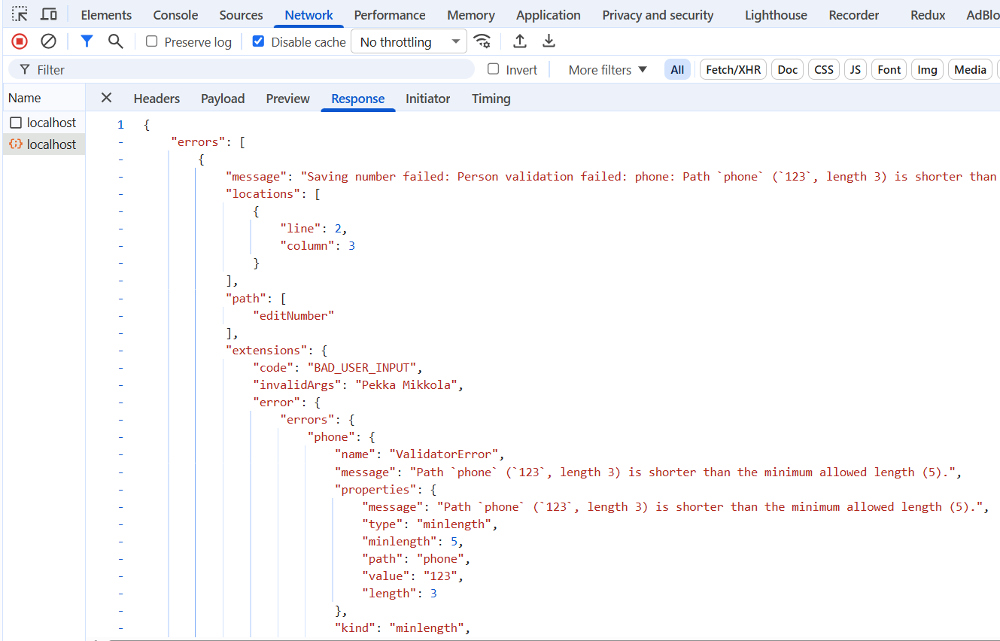
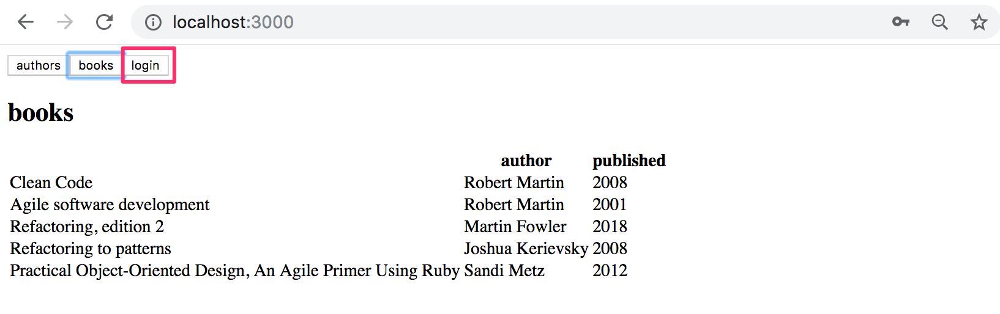
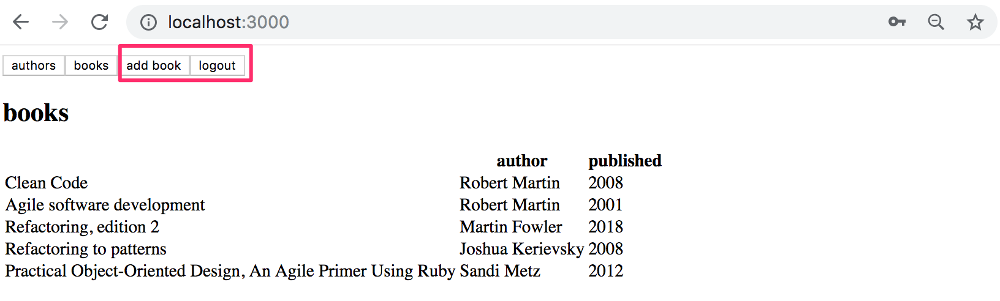
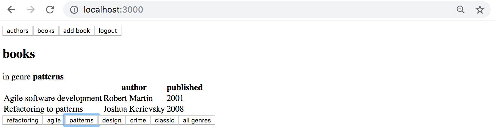
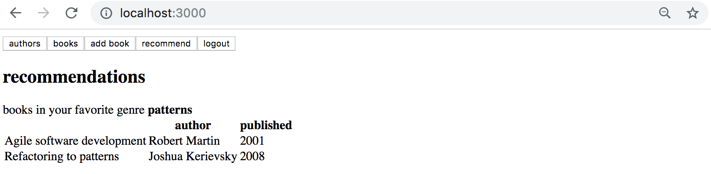
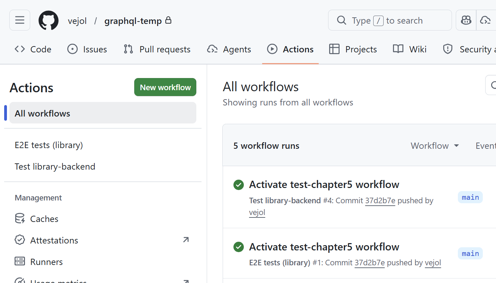

# Chapter 5: Login and updating the cache

Source: https://courses.mooc.fi/org/uh-cs/courses/full-stack-open-graphql/chapter-5
Exported: 2026-08-29T06:23:34.819Z

The frontend of our application shows the phone directory just fine with the updated server. However, if we want to add new persons, we have to add login functionality to the frontend.

## User login

Let’s first define the mutation for logging in in the file src/queries.js:

```
export const LOGIN = gql`
  mutation login($username: String!, $password: String!) {
    login(username: $username, password: $password)  {
      value
    }
  }
`
```

Let’s define the `LoginForm` component responsible for logging in in the file src/components/LoginForm.jsx. It works in much the same way as the earlier components that handle mutations. The interesting lines are highlighted in the code:

```
import { useState } from 'react'
import { useMutation } from '@apollo/client/react'
import { LOGIN } from '../queries'

const LoginForm = ({ setError, setToken }) => { // HIGHLIGHT LINE
  const [username, setUsername] = useState('')
  const [password, setPassword] = useState('')

  // BEGIN HIGHLIGHT
  const [ login ] = useMutation(LOGIN, {
    onCompleted: (data) => {
      const token = data.login.value
      setToken(token)
      localStorage.setItem('phonebook-user-token', token)
    },
    onError: (error) => {
      setError(error.message)
    }
  })
  // END HIGHLIGHT

  // BEGIN HIGHLIGHT
  const submit = (event) => {
    event.preventDefault()
    login({ variables: { username, password } })
  }
  // END HIGHLIGHT

  return (
    <div>
      <form onSubmit={submit}>
        <div>
          username <input
            value={username}
            onChange={({ target }) => setUsername(target.value)}
          />
        </div>
        <div>
          password <input
            type='password'
            value={password}
            onChange={({ target }) => setPassword(target.value)}
          />
        </div>
        <button type='submit'>login</button>
      </form>
    </div>
  )
}

export default LoginForm
```

The component receives the functions `setError` and `setToken` as props, which can be used to change the application state. Defining state management is left to the `App` component.

For the `useMutation` function that performs the login, an `onCompleted` callback function is defined. It is called when the mutation has been successfully executed. In the callback, the token value is read from the response data and then stored in the application state and in the browser’s localStorage.

Let’s now use the LoginForm component in the App.jsx file. We add a `token` variable to the application state to store the token once the user has logged in. If `token` is not defined, we render only the login form:

```
import LoginForm from './components/LoginForm' // HIGHLIGHT LINE
// ...

const App = () => {
  const [token, setToken] = useState(localStorage.getItem('phonebook-user-token')) // HIGHLIGHT LINE
  const [errorMessage, setErrorMessage] = useState(null)
  const result = useQuery(ALL_PERSONS)

  if (result.loading) {
    return <div>loading...</div>
  }

  const notify = (message) => {
    setErrorMessage(message)
    setTimeout(() => {
      setErrorMessage(null)
    }, 10000)
  }

  // BEGIN HIGHLIGHT
  if (!token) {
    return (
      <div>
        <Notify errorMessage={errorMessage} />
        <h2>Login</h2>
        <LoginForm
          setToken={setToken}
          setError={notify}
        />
      </div>
    )
  }
  // END HIGHLIGHT

  return (
    // ...
  )
}
```

The token is now initialized from a token value that may be found in localStorage:

```
const [token, setToken] = useState(localStorage.getItem('phonebook-user-token'))
```

This way, the token is also restored when the page is reloaded, and the user stays logged in. If localStorage does not contain a value for the key phonebook-user-token, the token value will be `null`.

We also add a button that allows a logged-in user to log out. In the button’s click handler, we set `token` to `null`, remove the token from localStorage, and reset the Apollo Client cache:

```
import { useApolloClient, useQuery } from '@apollo/client/react' // HIGHLIGHT LINE
//...

const App = () => {
  const [token, setToken] = useState(null)
  const [errorMessage, setErrorMessage] = useState(null)
  const result = useQuery(ALL_PERSONS)
  const client = useApolloClient() // HIGHLIGHT LINE
  
  if (result.loading)  {
    return <div>loading...</div>
  }

  // BEGIN HIGHLIGHT
  const onLogout = () => {
    setToken(null)
    localStorage.clear()
    client.resetStore()
  }
  // END HIGHLIGHT

  // ...

  return (
    <>
      <Notify errorMessage={errorMessage} />
      <button onClick={onLogout}>logout</button> // HIGHLIGHT LINE
      <Persons persons={result.data.allPersons} />
      <PersonForm setError={notify} />
      <PhoneForm setError={notify} />
    </>
  )
}
```

Resetting the cache is done using the Apollo `client` object’s [resetStore](https://www.apollographql.com/docs/react/api/core/ApolloClient#resetstore) method, and the client itself can be accessed with the [useApolloClient](https://www.apollographql.com/docs/react/api/react/useApolloClient) hook. Clearing the cache is [important](https://www.apollographql.com/docs/react/networking/authentication/#reset-store-on-logout), because some queries may have fetched data into the cache that only an authenticated user is allowed to access.

## Adding a token to a header

After the backend changes, creating new persons requires that a valid user token is sent with the request. This requires changes to the Apollo Client configuration in the main.jsx file:

```
import { StrictMode } from 'react'
import { createRoot } from 'react-dom/client'
import App from './App.jsx'

import { ApolloClient, HttpLink, InMemoryCache } from '@apollo/client'
import { ApolloProvider } from '@apollo/client/react'
import { SetContextLink } from '@apollo/client/link/context' // HIGHLIGHT LINE

// BEGIN HIGHLIGHT
const authLink  = new SetContextLink(({ headers }) => {
  const token = localStorage.getItem('phonebook-user-token')
  return {
    headers: {
      ...headers,
      authorization: token ? `Bearer ${token}` : null,
    }
  }
})
// END HIGHLIGHT

const httpLink = new HttpLink({ uri: 'http://localhost:4000' }) // HIGHLIGHT LINE

// BEGIN HIGHLIGHT
const client = new ApolloClient({
  cache: new InMemoryCache(),
  link: authLink.concat(httpLink)
})
// END HIGHLIGHT

createRoot(document.getElementById('root')).render(
  <StrictMode>
    <ApolloProvider client={client}>
      <App />
    </ApolloProvider>
  </StrictMode>,
)
```

As before, the server URL is wrapped using the [HttpLink](https://www.apollographql.com/docs/react/api/link/apollo-link-http) constructor to create a suitable `httpLink` object. This time, however, it is modified using the [context](https://www.apollographql.com/docs/react/api/link/apollo-link-context/#overview) defined by the `authLink` object so that, for each request, the authorization header is [set](https://www.apollographql.com/docs/react/networking/authentication/#header) to the token that may be stored in localStorage.

Creating new persons and changing numbers works again.

## Fixing validations

In the application, it should be possible to add a person without a phone number. However, if we now try to add a person without a phone number, it doesn’t work:


Validation fails, because frontend sends an empty string as the value of `phone`.

Let's change the function creating new persons so that it sets `phone` to `undefined` if user has not given a value:

```
const PersonForm = ({ setError }) => {
  // ...
  const submit = async (event) => {
    event.preventDefault()

    // BEGIN HIGHLIGHT
    createPerson({
      variables: {
        name,
        street,
        city,
        phone: phone.length > 0 ? phone : undefined,
      },
    })
    // END HIGHLIGHT

    setName('')
    setPhone('')
    setStreet('')
    setCity('')
  }

  // ...
}
```

From the perspective of the backend and the database, the phone attribute now has no value if the user leaves the field empty. Adding a person without a phone number works again.

There is also an issue with the functionality for changing a phone number. The database validations require that the phone number must be at least 5 characters long, but if we try to update an existing person’s phone number to one that is too short, nothing seems to happen. The person’s phone number is not updated, but on the other hand no error message is shown either.

From the console’s Network tab we can see that the request is answered with an error message:



Let’s modify the application so that validation errors are also shown when changing a phone number:

```
const PhoneForm = ({ setError }) => {
  // ...

  const submit = async (event) => {
    event.preventDefault()

    // BEGIN HIGHLIGHT
    try {
      await changeNumber({ variables: { name, phone } })
    } catch (error) {
      setError(error.message)
    }
    // END HIGHLIGHT

    setName('')
    setPhone('')
  }

  // ...
}
```

The request that updates the number, `changeNumber`, is now executed inside a try block. If the database validations fail, execution ends up in the catch block, where an appropriate error message is set in the application using the `setError` function:


## Updating cache, revisited

We have to [update](https://courses.mooc.fi/org/uh-cs/courses/full-stack-open-graphql/chapter-3#updating-the-cache) the cache of the Apollo client on creating new persons. We can update it using the mutation's `refetchQueries` option to define that the `ALL_PERSONS` query is done again.

```
const PersonForm = ({ setError }) => {
  // ...

  const [createPerson] = useMutation(CREATE_PERSON, {
    onError: (error) => setError(error.message),
    refetchQueries: [{ query: ALL_PERSONS }], // HIGHLIGHT LINE
  })

// ...
}
```

This approach is pretty good, the drawback being that the query is always rerun with any updates.

It is possible to optimize the solution by updating the cache manually. This is done by defining an appropriate [update](https://www.apollographql.com/docs/react/data/mutations/#the-update-function) callback for the mutation instead of using the `refetchQueries` attribute. Apollo executes this callback after the mutation completes:

```
const PersonForm = ({ setError }) => {
  // ...

  const [createPerson] = useMutation(CREATE_PERSON, {
    onError: (error) => setError(error.message),
    // BEGIN HIGHLIGHT
    update: (cache, response) => {
      cache.updateQuery({ query: ALL_PERSONS }, ({ allPersons }) => {
        return {
          allPersons: allPersons.concat(response.data.addPerson),
        }
      })
    },
    // END HIGHLIGHT
  })
 
  // ..
}
```

The callback function is given a reference to the cache and the data returned by the mutation as parameters. For example, in our case, this would be the created person.

Using the function [updateQuery](https://www.apollographql.com/docs/react/caching/cache-interaction/#using-updatequery-and-updatefragment) the code updates the query ALLPERSONS in the cache by adding the new person to the cached data.

In some situations, the only sensible way to keep the cache up to date is using the `update` callback.

When necessary, it is possible to disable cache for the whole application or [single queries](https://www.apollographql.com/docs/react/api/react/hooks/#options) by setting the field managing the use of cache, [fetchPolicy](https://www.apollographql.com/docs/react/data/queries#setting-a-fetch-policy) as `no-cache`.

Be diligent with the cache. Old data in the cache can cause hard-to-find bugs. As we know, keeping the cache up to date is very challenging. According to a coder proverb:

> 

The current code of the application can be found on [Github](https://github.com/fullstack-hy2020/graphql-phonebook-frontend/tree/part8-5), branch part8-5.

## Exercise: 18. Listing books

After the backend changes, the list of books does not work anymore. Fix it.

## Exercise: 19. Log in

Adding new books and changing the birth year of an author do not work because they require a user to be logged in.

Implement login functionality and fix the mutations.

It is not necessary yet to handle validation errors.

Make the login form into a separate view which can be accessed through a navigation menu:



The login form:


When a user is logged in, the navigation changes to show the functionalities which can only be done by a logged-in user:



Also make sure that the Set birthyear form is only rendered when the user is logged in.

## Exercise: 20. Books by genre, part 1

Complete your application to filter the book list by genre. Your solution might look something like this:



In this exercise, the filtering can be done using just React.

## Exercise: 21. Books by genre, part 2

Implement a view which shows all the books based on the logged-in user's favourite genre.



## Exercise: 22. Books by genre with GraphQL

In the previous two exercises, the filtering could have been done using just React. To complete this exercise, you should redo the filtering of the books based on a selected genre (that was done in exercise 8.20) using a GraphQL query to the server. If you already did so then you do not have to do anything.

This and the next exercise are quite challenging, like they should be this late in the course. It may help you to complete the easier exercises in the [next chapter](https://courses.mooc.fi/org/uh-cs/courses/full-stack-open-graphql/chapter-6) before doing 8.22 and 8.23.

## Exercise: 23. Up-to-date cache and book recommendations

Ensure somehow that the books view is kept up to date. So when a new book is added, the books view is updated at least when a genre selection button is pressed.

When new genre selection is not done, the view does not have to be updated.

## Exercise: 24. Checkup

In this exercise you will run automated tests just like in exercise 17. The tests in this chapter test the frontend and its interaction with the backend.

Running the tests locally

Navigate to the directory tests-chapter5. Before running the tests for the first time, install the dependencies required by the test project with the command:

```
npm install && npx playwright install chromium
```

Run the tests with the command `npm test` and make sure they pass.

Running the tests in GitHub Actions

The file .github/workflows/test-chapter5.yml defines another GitHub Actions workflow that runs the tests in this chapter on GitHub whenever you push a new commit.

The workflow is currently disabled. Activate it by uncommenting the lines at the beginning of the file, so that the definition looks as follows:

```
on:
  push:
    branches: [main, master]
  workflow_dispatch:
```

The workflow is run whenever you push a new commit to GitHub. Make sure that both workflows run successfully in GitHub Actions:


