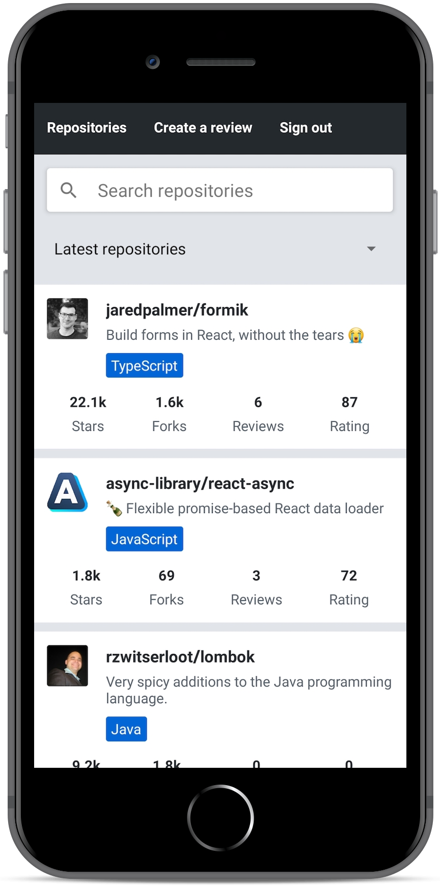
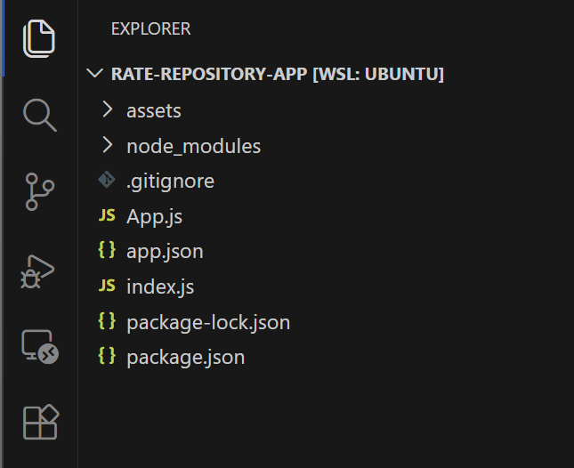
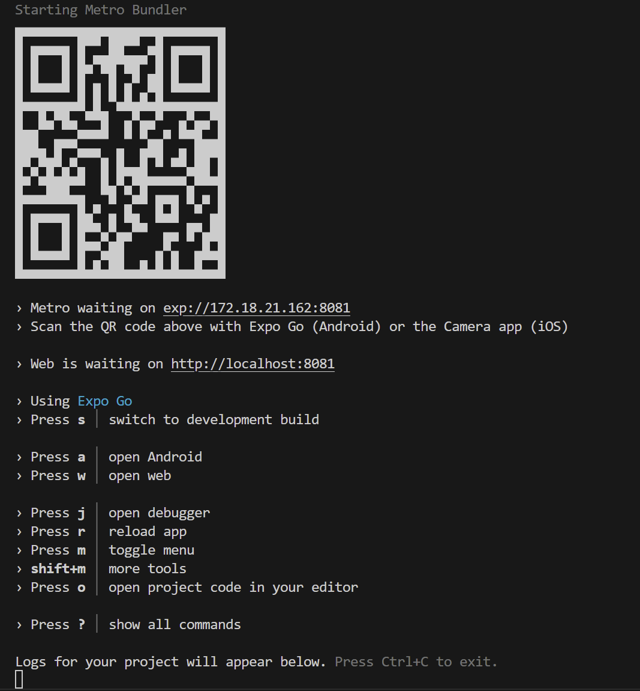
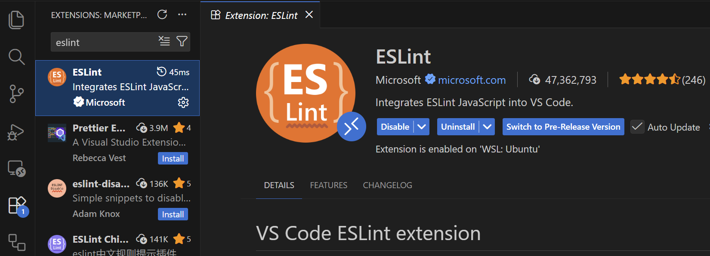
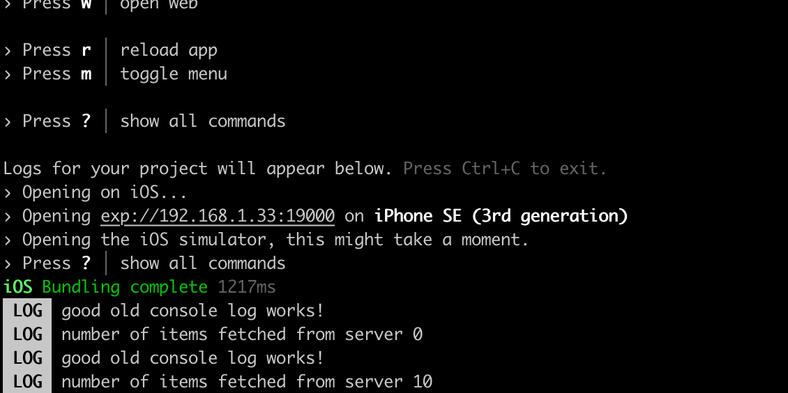
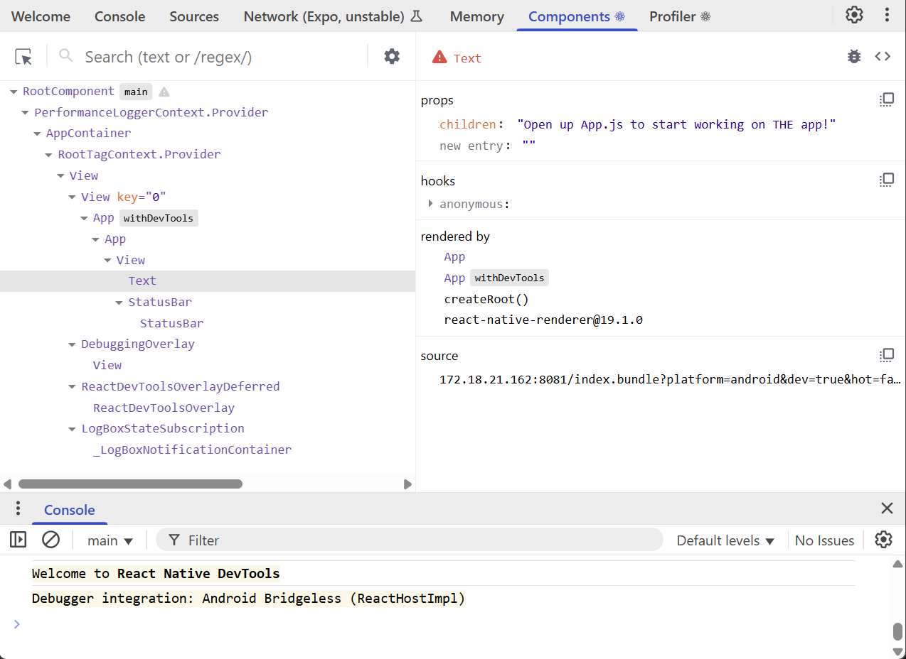

# Introduction to React Native

Source: https://courses.mooc.fi/org/uh-cs/courses/full-stack-open-react-native/chapter-2
Exported: 2026-09-13T08:03:38.501Z

Traditionally, developing native iOS and Android applications has required the developer to use platform-specific programming languages and development environments. For iOS development, this means using Objective C or Swift and for Android development using JVM-based languages such as Java, Scala or Kotlin. Releasing an application for both these platforms technically requires developing two separate applications with different programming languages. This requires lots of development resources.

One of the popular approaches to unify the platform-specific development has been to utilize the browser as the rendering engine. [Cordova](https://cordova.apache.org/) is one of the most popular platforms for building cross-platform applications. It allows for developing multi-platform applications using standard web technologies - HTML5, CSS3, and JavaScript. However, Cordova applications are running within an embedded browser window in the user's device. That is why these applications can not achieve the performance nor the look-and-feel of native applications that utilize actual native user interface components.

[React Native](https://reactnative.dev/) is a framework for developing native Android and iOS applications using JavaScript and React. It provides a set of cross-platform components that behind the scenes utilize the platform's native components. Using React Native allows us to bring all the familiar features of React such as JSX, components, props, state, and hooks into native application development. On top of that, we can utilize many familiar libraries in the React ecosystem such as [React Redux](https://react-redux.js.org/), [Apollo](https://www.apollographql.com/docs/react), [React Router](https://reactrouter.com/en/main) and many more.

The speed of development and gentle learning curve for developers familiar with React is one of the most important benefits of React Native. Here's a motivational quote from Coinbase's article [Onboarding thousands of users with React Native](https://benbronsteiny.wordpress.com/2020/02/27/onboarding-thousands-of-users-with-react-native/) on the benefits of React Native:

> 

## About this part

During this part, we will be developing an application for rating [GitHub](https://github.com/) repositories. Our application will have features such as, sorting and filtering reviewed repositories, registering a user, logging in and creating a review for a repository. The backend for the application will be provided for us so that we can solely focus on the React Native development.

This part is structured based on the idea that you develop your application as you progress in the material. So do not wait until the exercises to start the development. Instead, develop your application at the same pace as the material progresses.

The final version of our application will look something like this:



## Initializing the application

To get started with our application we need to set up our development environment. We have learned from previous parts that there are useful tools for setting up React applications quickly such as Vite. Luckily React Native has these kinds of tools as well.

For the development of our application, we will be using [Expo](https://docs.expo.dev/versions/latest/). Expo is a platform that eases the setup, development, building, and deployment of React Native applications. Expo has a [few limitations](https://docs.expo.dev/faq/#limitations) when compared to plain React Native CLI. However, these limitations do not affect the application implemented in the material.

Let's get started with Expo by initializing our project with create-expo-app:

```
npx create-expo-app rate-repository-app --template blank@sdk-55
```

> 

Next, let's navigate to the created rate-repository-app directory with the terminal and install a few dependencies we'll be needing soon:

```
npx expo install react-native-web react-dom @expo/metro-runtime
```

Now that our application has been initialized, open the created rate-repository-app directory with an editor such as [Visual Studio Code](https://code.visualstudio.com/). The structure should be more or less the following:



We might spot some familiar files and directories such as package.json and node_modules. On top of those, the most relevant files are the app.json file which contains Expo-related configuration and App.js which is the root component of our application. Do not rename or move the App.js file because by default Expo imports it to [register the root component](https://docs.expo.dev/versions/latest/sdk/expo/#registerrootcomponentcomponent).

Let's look at the scripts section of the package.json file which has the following scripts:

```
{
  // ...
  "scripts": {
    "start": "expo start",
    "android": "expo start --android",
    "ios": "expo start --ios",
    "web": "expo start --web"
  },
  // ...
}
```

Let us now run the script `npm start`



> 

The command starts the Expo development server ([Expo CLI](https://docs.expo.dev/more/expo-cli/)). The server uses [Metro bundler](https://metrobundler.dev/), which bundles JavaScript and serves it to the app. The command-line interface has a useful set of commands for viewing the application logs and starting the application in an emulator or on a physical device (e.g. with Expo Go). We will get to emulators and Expo Go soon, but first, let's open our application in the browser.

Expo command-line interface suggests a few ways to open our application. Let's press the "w" key in the terminal window to open the application in a browser. We should soon see the text defined in the App.js file in a browser window. Open the App.js file with an editor and make a small change to the text in the `Text` component. After saving the file, the changes should usually appear automatically thanks to Fast Refresh.

## Setting up the virtual devices

We have had the first glance of our application using the Expo's browser view. Although the browser view is quite usable, it is still a quite poor simulation of the native environment. Let's have a look at the alternatives we have regarding the development environment.

Android and iOS devices such as tablets and phones can be emulated in computers using specific emulators. This is very useful for developing native applications. macOS users can use both Android and iOS emulators with their computers. Users of other operating systems, such as Linux and Windows, have to settle for Android emulators. Next, depending on your operating system follow one of these instructions on setting up an emulator:

- [Set up the Android emulator with Android Studio](https://docs.expo.dev/workflow/android-studio-emulator/#set-up-android-studio) (any operating system)
- [Set up the iOS simulator with Xcode](https://docs.expo.dev/workflow/ios-simulator/) (macOS operating system)

When you have finished setting up the emulator, start it so that you can see the virtual device on your screen. Then start the Expo CLI as we did before, by running `npm start`. Depending on the emulator you are running either press the corresponding key for the "open Android" or "open iOS simulator". After pressing the key, Expo should connect to the emulator and you should eventually see the application in your emulator. Be patient, this might take a while.

## Using your own phone with Expo Go

In addition to emulators, there is one extremely useful way to develop React Native applications with Expo: the Expo Go app. With Expo Go, you can preview your application using your actual mobile device, which provides a bit more concrete development experience compared to emulators.

The major version of Expo Go should match the version of the Expo SDK being used, which in this case is 55. Some versions of Expo Go may also support projects that use a slightly older SDK version, but this is not guaranteed. Note that the Expo Go version available in app stores may not be the same as the SDK version used in this course.

Let us install Expo Go:

- On Android phones, it is possible to install any Expo Go version from [Expo’s website](https://expo.dev/go).
- Unfortunately, iOS users must use the version available in the App Store, which may not be compatible with the course material. If you want, you can use an SDK version in the course that matches the Expo Go version available in the App Store. However, note that not all parts of the course material are necessarily compatible with other SDK versions. (Expo Go version 55 should be released to the App Store very soon.)

In case you installed Expo Go from app store, it’s recommended to disable automatic updates for the app in the app store, as updates may break compatibility. For the easiest setup, keep your mobile device on the same local network (e.g. the same Wi-Fi) as your development machine.

Next, if the Expo development tools are not already running, start them by running `npm start`. You should be able to see a QR code at the beginning of the command output. Open the app by scanning the QR code in Expo Go. Expo Go should start building the JavaScript bundle and after it is finished you should be able to see your application. Now, every time you want to reopen your application in Expo Go, you should be able to access the application without scanning the QR code by pressing it in the Recently opened list in the Projects view.

If your phone can’t connect to the development server, you can try starting Expo CLI with command:

```
npx expo start --tunnel
```

In this mode, your devices don’t need to be on the same local network—the traffic is routed over the internet instead. This can help work around various firewall and network configuration issues. However, Expo Go may run more slowly because the code and bundles are now fetched through the tunnel.

## Exercise: 1. initializing the application

Initialize your application with Expo command-line interface and set up the development environment either using an emulator or Expo's mobile app. It is recommended to try both and find out which development environment is the most suitable for you. Name your application rate-repository-app.

To submit this exercise and all future exercises you need [a GitHub repository](https://github.com/new). You can use the same repository as in the previous parts if you want, as long as the folder structure is clear and the different parts are neatly separated into their own.

If you decide to use a private repository, add GitHub user [mluukkai](https://github.com/mluukkai) as a [repository collaborator](https://docs.github.com/en/github/setting-up-and-managing-your-github-user-account/inviting-collaborators-to-a-personal-repository). The collaborator status is only used for verifying your submissions.

Just commit and push your changes into the repository and you are all done.

## ESLint

Now that we are somewhat familiar with the development environment let's enhance our development experience even further by configuring a linter. We will be using [ESLint](https://eslint.org/) which is already familiar to us from the previous parts. Let's set up ESLint with the command:

```
npx expo lint
```

The command will install the necessary dependencies and create an eslint.config.js file in the project root. It also adds automatically `lint` script to the package.json file:

```
"scripts": {
    "start": "expo start",
    "android": "expo start --android",
    "ios": "expo start --ios",
    "web": "expo start --web",
    "lint": "expo lint"  }, // HIGHLIGHT LINE
```

The eslint.config.js looks like follows:

```
// https://docs.expo.dev/guides/using-eslint/
const { defineConfig } = require('eslint/config');
const expoConfig = require("eslint-config-expo/flat");

module.exports = defineConfig([
  expoConfig,
  {
    ignores: ["dist/*"],
  }
]);
```

The file is short, but it includes the most important ESLint rules for a React Native project. eslint-config-expo/flat is an all-in-one preset that automatically provides ESLint's base rules, React rules, React Native Rules and Expo-specific best practices.

After the initial setup, you can lint your code by running:

```
npm run lint
```

You can also integrate ESLint with your editor. In Visual Studio Code, you can do that by going to the extensions section and checking that the ESLint extension is installed and enabled:



The provided ESLint configuration is only a starting point. Feel free to edit it and add your own rules if you feel like it.

## Exercise: 2. Setting up the ESLint

Set up ESLint in your project so that you can perform linter checks by running `npm run lint`. To get most of linting it is also recommended to integrate ESLint with your editor.

## Debugging

When our application doesn't work as intended, we should immediately start debugging it. In practice, this means that we'll need to reproduce the erroneous behavior and monitor the code execution to find out which part of the code behaves incorrectly. During the course, we have already done a bunch of debugging by logging messages, inspecting network traffic, and using specific development tools, such as React Developer Tools. In general, debugging isn't that different in React Native, we'll just need the right tools for the job.

The good old console.log messages appear in the Expo CLI command line:



That might actually be enough in most cases, but sometimes we need more.

React Native provides an [in-app developer menu](https://docs.expo.dev/debugging/tools/#developer-menu) which offers several debugging options and lets you do things like reload the app. You can toggle the Element Inspector, which shows an overlay for inspecting UI elements and their layout. Another useful option is the Performance Monitor, an in-app overlay that shows basic performance metrics such as FPS and JS/UI thread activity.

[React Native DevTools](https://reactnative.dev/docs/react-native-devtools) is a powerful tool for debugging your app. It offers a similar set of debugging features as the Chrome's DevTools, and it also includes the same features as React DevTools, which we have previously used as a Chrome browser extension.

When the app is running in an emulator or on your phone via Expo Go, you can open React Native DevTools from Expo CLI by pressing `j`. DevTools will open in a browser window:



You can use the DevTools to inspect the component's state and props as well as change them. Try finding the `Text` component rendered by the `App` component using the DevTools. You can either use the search or go through the component tree. Once you have found the `Text` component in the tree, click it, and change the value of the `children` prop. The change should be automatically visible in the application's preview.

You can read more about the different React Native debugging options in Expo’s [debugging documentation](https://docs.expo.dev/debugging/tools/).
