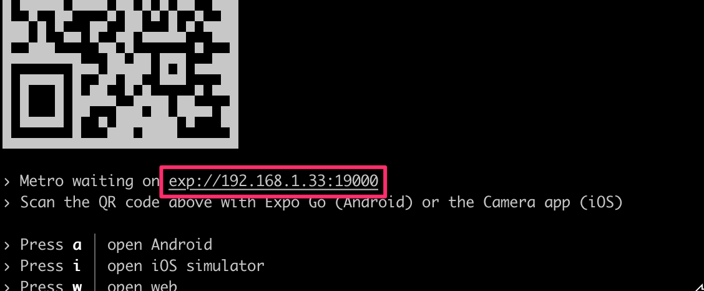

# Communicating with server

Source: https://courses.mooc.fi/org/uh-cs/courses/full-stack-open-react-native/chapter-4
Exported: 2026-09-13T08:03:38.501Z

So far we have implemented features to our application without any actual server communication. For example, the reviewed repositories list we have implemented uses mock data and the sign in form doesn't send the user's credentials to any authentication endpoint. In this section, we will learn how to communicate with a server using HTTP requests, how to use Apollo Client in a React Native application, and how to store data in the user's device.

Soon we will learn how to communicate with a server in our application. Before we get to that, we need a server to communicate with. For this purpose, we have a completed server implementation in the [rate-repository-api](https://github.com/fullstack-hy2020/rate-repository-api) repository. The rate-repository-api server fulfills all our application's API needs during this part. It uses [SQLite](https://www.sqlite.org/index.html) database which doesn't need any setup and provides an Apollo GraphQL API along with a few REST API endpoints.

Before heading further into the material, set up the rate-repository-api server by following the setup instructions in the repository's [README](https://github.com/fullstack-hy2020/rate-repository-api/blob/master/README.md). Note that if you are using an emulator for development it is recommended to run the server and the emulator on the same computer. This eases network requests considerably.

## HTTP requests

React Native provides [Fetch API](https://developer.mozilla.org/en-US/docs/Web/API/Fetch_API) for making HTTP requests in our applications. React Native also supports the good old [XMLHttpRequest API](https://developer.mozilla.org/en-US/docs/Web/API/XMLHttpRequest) which makes it possible to use third-party libraries such as [Axios](https://github.com/axios/axios). These APIs are the same as the ones in the browser environment and they are globally available without the need for an import.

People who have used both Fetch API and XMLHttpRequest API most likely agree that the Fetch API is easier to use and more modern. However, this doesn't mean that XMLHttpRequest API doesn't have its uses. For the sake of simplicity, we will only be using the Fetch API in our examples.

Sending HTTP requests using the Fetch API can be done using the `fetch` function. The first argument of the function is the URL of the resource:

```
fetch('https://my-api.com/get-end-point');
```

The default request method is GET. The second argument of the `fetch` function is an options object, which you can use for example to specify a different request method, request headers, or request body:

```
fetch('https://my-api.com/post-end-point', {
  method: 'POST',
  headers: {
    Accept: 'application/json',
    'Content-Type': 'application/json',
  },
  body: JSON.stringify({
    firstParam: 'firstValue',
    secondParam: 'secondValue',
  }),
});
```

Note that these URLs are made up and won't (most likely) send a response to your requests. In comparison to Axios, the Fetch API operates on a bit lower level. For example, there isn't any request or response body serialization and parsing. This means that you have to for example set the Content-Type header by yourself and use `JSON.stringify` method to serialize the request body.

The `fetch` function returns a promise which resolves a [Response](https://developer.mozilla.org/en-US/docs/Web/API/Response) object. Note that error status codes such as 400 and 500 are not rejected like for example in Axios. In case of a JSON formatted response we can parse the response body using the `Response.json` method:

```
const fetchMovies = async () => {
  const response = await fetch('https://reactnative.dev/movies.json');
  const json = await response.json();

  return json;
};
```

For a more detailed introduction to the Fetch API, read the [Using Fetch](https://developer.mozilla.org/en-US/docs/Web/API/Fetch_API/Using_Fetch) article in the MDN web docs.

Next, let's try the Fetch API in practice. The rate-repository-api server provides an endpoint for returning a paginated list of reviewed repositories. Once the server is running, you should be able to access the endpoint at [http://localhost:5000/api/repositories](http://localhost:5000/api/repositories) (unless you have changed the port). The data is paginated in a common [cursor based pagination format](https://graphql.org/learn/pagination/). The actual repository data is behind the node key in the edges array.

Unfortunately, if we´re using external device, we can't access the server directly in our application by using the [http://localhost:5000/api/repositories](http://localhost:5000/api/repositories) URL. To make a request to this endpoint in our application we need to access the server using its IP address in its local network. To find out what it is, open the Expo development tools by running `npm start`. In the console you should be able to see an URL starting with exp:// below the QR code, after the "Metro waiting on" text:



Copy the IP address between the exp:// and :, which is in this example 192.168.1.33. Construct an URL in format http://<IP_ADDRESS>:5000/api/repositories and open it in the browser. You should see the same response as you did with the localhost URL.

Now that we know the end point's URL let's use the actual server-provided data in our reviewed repositories list. We are currently using mock data stored in the `repositories` variable. Remove the `repositories` variable and replace the usage of the mock data with this piece of code in the RepositoryList.jsx file in the components directory:

```
import { useState, useEffect } from 'react';  // HIGHLIGHT LINE
// ...

const RepositoryList = () => {
  // BEGIN HIGHLIGHT
  const [repositories, setRepositories] = useState();
 
  const fetchRepositories = async () => {
    // Replace the IP address part with your own IP address!
    const response = await fetch('http://192.168.1.33:5000/api/repositories');
    const json = await response.json();
 
    console.log(json);
 
    setRepositories(json);
  };
 
  useEffect(() => {
    fetchRepositories();
  }, []);
 
  // Get the nodes from the edges array
  const repositoryNodes = repositories
    ? repositories.edges.map(edge => edge.node)
    : [];
  // END HIGHLIGHT

  return (
    <FlatList
      data={repositoryNodes}  // HIGHLIGHT LINE
      // Other props
    />
  );
};

export default RepositoryList;
```

We are using React's `useState` hook to maintain the repository list state and the `useEffect` hook to call the `fetchRepositories` function when the `RepositoryList` component is mounted. We extract the actual repositories into the `repositoryNodes` variable and replace the previously used `repositories` variable in the `FlatList` component's `data` prop with it. Now you should be able to see actual server-provided data in the reviewed repositories list.

It is usually a good idea to log the server's response during the development phase to be able to inspect it as we did in the `fetchRepositories` function. You should be able to see this log message in the Expo CLI console or in Expo development tools if you navigate to your device's logs as we learned in the [Debugging](https://courses.mooc.fi/org/uh-cs/courses/full-stack-open-react-native/chapter-2#debugging) section. If you are using the Expo's mobile app for development and the network request is failing, make sure that the computer you are using to run the server and your phone are connected to the same Wi-Fi network. If that's not possible either use an emulator in the same computer as the server is running in or [use the tunnel option](https://fullstackopen.com/en/part10/introduction_to_react_native#using-your-own-phone-with-expo-go).

The current data fetching code in the `RepositoryList` component could do with some refactoring. For instance, the component is aware of the network request's details such as the end point's URL. In addition, the data fetching code has lots of reuse potential. Let's refactor the component's code by extracting the data fetching code into its own hook. Create a directory hooks in the src directory and in that hooks directory create a file useRepositories.js with the following content:

```
import { useState, useEffect } from 'react';

const useRepositories = () => {
  const [repositories, setRepositories] = useState();
  const [loading, setLoading] = useState(false);

  const fetchRepositories = async () => {
    setLoading(true);

    // Replace the IP address part with your own IP address!
    const response = await fetch('http://192.168.1.33:5000/api/repositories');
    const json = await response.json();

    setLoading(false);
    setRepositories(json);
  };

  useEffect(() => {
    fetchRepositories();
  }, []);

  return { repositories, loading, refetch: fetchRepositories };
};

export default useRepositories;
```

Now that we have a clean abstraction for fetching the reviewed repositories, let's use the `useRepositories` hook in the `RepositoryList` component:

```
// ...
import useRepositories from '../hooks/useRepositories'; // HIGHLIGHT LINE

const RepositoryList = () => {
  const { repositories } = useRepositories(); // HIGHLIGHT LINE

  const repositoryNodes = repositories
    ? repositories.edges.map(edge => edge.node)
    : [];

  return (
    <FlatList
      data={repositoryNodes}
      // Other props
    />
  );
};

export default RepositoryList;
```

That's it, now the `RepositoryList` component is no longer aware of the way the repositories are acquired. Maybe in the future, we will acquire them through a GraphQL API instead of a REST API. We will see what happens.

## GraphQL and Apollo client

In [part 8](https://fullstackopen.com/en/part8) we learned about GraphQL and how to send GraphQL queries to an Apollo Server using the [Apollo Client](https://www.apollographql.com/docs/react/) in React applications. The good news is that we can use the Apollo Client in a React Native application exactly as we would with a React web application.

As mentioned earlier, the rate-repository-api server provides a GraphQL API which is implemented with Apollo Server. Once the server is running, you can access the [Apollo Sandbox](https://www.apollographql.com/docs/graphos/platform/sandbox) at [http://localhost:4000](http://localhost:4000/). Apollo Sandbox is a tool for making GraphQL queries and inspecting the GraphQL APIs schema and documentation. If you need to send a query in your application always test it with the Apollo Sandbox first before implementing it in the code. It is much easier to debug possible problems in the query in the Apollo Sandbox than in the application. If you are uncertain what the available queries are or how to use them, you can see the documentation next to the operations editor:


In our React Native application, we will be using the same [@apollo/client](https://www.npmjs.com/package/@apollo/client) library as in part 8. Let's get started by installing the library along with the [graphql](https://www.npmjs.com/package/graphql) library which is required as a peer dependency:

```
npm install @apollo/client graphql
```

Let's create a utility function for creating the Apollo Client with the required configuration. Create a utils directory in the src directory and in that utils directory create a file apolloClient.js. In that file configure the Apollo Client to connect to the Apollo Server:

```
import { ApolloClient, HttpLink, InMemoryCache } from '@apollo/client';

const httpLink = new HttpLink({
  uri: 'http://192.168.1.100:4000/graphql',
});

const createApolloClient = () => {
  return new ApolloClient({
    link: httpLink,
    cache: new InMemoryCache(),
  });
};

export default createApolloClient;
```

The URL used to connect to the Apollo Server is otherwise the same as the one you used with the Fetch API except the port is 4000 and the path is /graphql. Lastly, we need to provide the Apollo Client using the [ApolloProvider](https://www.apollographql.com/docs/react/api/react/ApolloProvider) context. We will add it to the `App` component in the App.js file:

```
import { ApolloProvider } from '@apollo/client/react';  // HIGHLIGHT LINE
import { StatusBar } from 'expo-status-bar';
import { NativeRouter } from 'react-router-native';

import Main from './src/components/Main';
import createApolloClient from './src/utils/apolloClient'; // HIGHLIGHT LINE

const apolloClient = createApolloClient(); // HIGHLIGHT LINE

const App = () => {
  return (
    <StatusBar style="light" />
    <NativeRouter>
      <ApolloProvider client={apolloClient}> // HIGHLIGHT LINE
        <Main />
      </ApolloProvider> // HIGHLIGHT LINE
    </NativeRouter>
  );
};

export default App;
```

## Organizing GraphQL related code

It is up to you how to organize the GraphQL related code in your application. However, for the sake of a reference structure, let's have a look at one quite simple and efficient way to organize the GraphQL related code. In this structure, we define queries, mutations, fragments, and possibly other entities in their own files. These files are located in the same directory. Here is an example of the structure you can use to get started:


You can import the `gql` template literal tag used to define GraphQL queries from @apollo/client library. If we follow the structure suggested above, we could have a queries.js file in the graphql directory for our application's GraphQL queries. Each of the queries can be stored in a variable and exported like this:

```
import { gql } from '@apollo/client';

export const GET_REPOSITORIES = gql`
  query {
    repositories {
      ${/* ... */}
    }
  }
`;

// other queries...
```

We can import these variables and use them with the `useQuery` hook like this:

```
import { useQuery } from '@apollo/client/react';

import { GET_REPOSITORIES } from '../graphql/queries';

const Component = () => {
  const { data, error, loading } = useQuery(GET_REPOSITORIES);
  // ...
};
```

The same goes for organizing mutations. The only difference is that we define them in a different file, mutations.js. It is recommended to use [fragments](https://www.apollographql.com/docs/react/data/fragments/) in queries to avoid retyping the same fields over and over again.

## Evolving the structure

Once our application grows larger there might be times when certain files grow too large to manage. For example, we have component `A` which renders the components `B` and `C`. All these components are defined in a file A.jsx in a components directory. We would like to extract components `B` and `C` into their own files B.jsx and C.jsx without major refactors. We have two options:

- Create files B.jsx and C.jsx in the components directory. This results in the following structure:

```
components/
  A.jsx
  B.jsx
  C.jsx
  ...
```

- Create a directory A in the components directory and create files B.jsx and C.jsx there. To avoid breaking components that import the A.jsx file, move the A.jsx file to the A directory and rename it to index.jsx. This results in the following structure:

```
components/
  A/
    B.jsx
    C.jsx
    index.jsx
  ...
```

The first option is fairly decent, however, if components `B` and `C` are not reusable outside the component `A`, it is useless to bloat the components directory by adding them as separate files. The second option is quite modular and doesn't break any imports because importing a path such as ./A will match both A.jsx and A/index.jsx.

## Exercise 10.11

### Exercise 10.11: fetching repositories with Apollo Client

## Exercise: 11. Fetching repositories with Apollo Client

We want to replace the Fetch API implementation in the `useRepositories` hook with a GraphQL query. Open the Apollo Sandbox at [http://localhost:4000](http://localhost:4000/) and take a look at the documentation next to the operations editor. Look up the `repositories` query. The query has some arguments, however, all of these are optional so you don't need to specify them. In the Apollo Sandbox form a query for fetching the repositories with the fields you are currently displaying in the application. The result will be paginated and it contains the up to first 30 results by default. For now, you can ignore the pagination entirely.

Once the query is working in the Apollo Sandbox, use it to replace the Fetch API implementation in the `useRepositories` hook. This can be achieved using the [useQuery](https://www.apollographql.com/docs/react/api/react/useQuery) hook. To avoid future caching issues, use the `cache-and-network` [fetch policy](https://www.apollographql.com/docs/react/data/queries/#setting-a-fetch-policy) in the query. It can be used with the `useQuery` hook like this:

```
useQuery(MY_QUERY, {
  fetchPolicy: 'cache-and-network',
  // Other options
});
```

The `gql` template literal tag can be imported from the @apollo/client library as instructed earlier. Consider using the structure recommended earlier for the GraphQL related code.

The changes in the `useRepositories` hook should not affect the `RepositoryList` component in any way.

## Environment variables

Every application will most likely run in more than one environment. Two obvious candidates for these environments are the development environment and the production environment. Out of these two, the development environment is the one we are running the application right now. Different environments usually have different dependencies, for example, the server we are developing locally might use a local database whereas the server that is deployed to the production environment uses the production database. To make the code environment independent we need to parameterize these dependencies. At the moment we are using one very environment dependant hardcoded value in our application: the URL of the server.

We have previously learned that we can provide running programs with environment variables. These variables can be defined in the command line or using environment configuration files such as .env files. Earlier in the course, we used the dotenv library to read .env files. Expo automatically reads the .env file defined in the project root, so the dotenv library is not needed. However, each environment variable must start with the `EXPO_PUBLIC_` prefix. You can read more in the [Expo documentation](https://docs.expo.dev/guides/environment-variables/).

Let's create a .env file in the project root with the following content:

```
EXPO_PUBLIC_ENV=test
```

Here, we define an environment variable named `EXPO_PUBLIC_ENV`. You may need to restart Expo development tools to apply the changes you have made to the .env file.

As usual, you can access the environment variable in the application using the syntax `process.env.EXPO_PUBLIC_ENV`. As a quick test, we can log the environment variable in the App component:

```
import { ApolloProvider } from '@apollo/client/react';
import { StatusBar } from 'expo-status-bar';
import { NativeRouter } from 'react-router-native';

import Main from './src/components/Main';
import createApolloClient from './src/utils/apolloClient';

const apolloClient = createApolloClient();

const App = () => {
  console.log("env check:", process.env.EXPO_PUBLIC_ENV);  // HIGHLIGHT LINE

  return (
    // ...
  );
};

export default App;
```

You should now see 'env check: test' in the logs.

Note that it is never a good idea to put sensitive data into the application's configuration. The reason for this is that once a user has downloaded your application, they can, at least in theory, reverse engineer your application and figure out the sensitive data you have stored into the code. Environment variables used by Expo can be found in plain text in the compiled app, so do not include sensitive information, such as private keys, in `EXPO_PUBLIC_` variables.

## Exercise: 12. Environment variables

Instead of the hardcoded Apollo Server's URL, use an environment variable defined in the .env file when initializing the Apollo Client. You can name the environment variable for example `EXPO_PUBLIC_APOLLO_URI`.

## Storing data in the user's device

There are times when we need to store some persisted pieces of data in the user's device. One such common scenario is storing the user's authentication token so that we can retrieve it even if the user closes and reopens our application. In web development, we have used the browser's `localStorage` object to achieve such functionality. React Native provides similar persistent storage, the [AsyncStorage](https://github.com/react-native-async-storage/async-storage?tab=readme-ov-file#usage).

We can use the `npx expo install` command to install the version of the @react-native-async-storage/async-storage package that is suitable for our Expo SDK version:

```
npx expo install @react-native-async-storage/async-storage
```

The API of the `AsyncStorage` is in many ways same as the `localStorage` API. They are both key-value storages with similar methods. The biggest difference between the two is that, as the name implies, the operations of `AsyncStorage` are asynchronous.

Because `AsyncStorage` operates with string keys in a global namespace it is a good idea to create a simple abstraction for its operations. This abstraction can be implemented for example using a [class](https://developer.mozilla.org/en-US/docs/Web/JavaScript/Reference/Classes). As an example, we could implement a shopping cart storage for storing the products user wants to buy:

```
import AsyncStorage from '@react-native-async-storage/async-storage';

class ShoppingCartStorage {
  constructor(namespace = 'shoppingCart') {
    this.namespace = namespace;
  }

  async getProducts() {
    const rawProducts = await AsyncStorage.getItem(
      `${this.namespace}:products`,
    );

    return rawProducts ? JSON.parse(rawProducts) : [];
  }

  async addProduct(productId) {
    const currentProducts = await this.getProducts();
    const newProducts = [...currentProducts, productId];

    await AsyncStorage.setItem(
      `${this.namespace}:products`,
      JSON.stringify(newProducts),
    );
  }

  async clearProducts() {
    await AsyncStorage.removeItem(`${this.namespace}:products`);
  }
}

const doShopping = async () => {
  const shoppingCartA = new ShoppingCartStorage('shoppingCartA');
  const shoppingCartB = new ShoppingCartStorage('shoppingCartB');

  await shoppingCartA.addProduct('chips');
  await shoppingCartA.addProduct('soda');

  await shoppingCartB.addProduct('milk');

  const productsA = await shoppingCartA.getProducts();
  const productsB = await shoppingCartB.getProducts();

  console.log(productsA, productsB);

  await shoppingCartA.clearProducts();
  await shoppingCartB.clearProducts();
};

doShopping();
```

Because `AsyncStorage` keys are global, it is usually a good idea to add a namespace for the keys. In this context, the namespace is just a prefix we provide for the storage abstraction's keys. Using the namespace prevents the storage's keys from colliding with other `AsyncStorage` keys. In this example, the namespace is defined as the constructor's argument and we are using the `namespace:key` format for the keys.

We can add an item to the storage using the `AsyncStorage.setItem` method. The first argument of the method is the item's key and the second argument its value. The value must be a string, so we need to serialize non-string values as we did with the `JSON.stringify` method. The `AsyncStorage.getItem` method can be used to get an item from the storage. The argument of the method is the item's key, of which value will be resolved. The `AsyncStorage.removeItem` method can be used to remove the item with the provided key from the storage.

NB: [SecureStore](https://docs.expo.dev/versions/latest/sdk/securestore/) is similar persisted storage as the `AsyncStorage` but it encrypts the stored data. This makes it more suitable for storing more sensitive data.

## Exercise: 13. The sign in form mutation

The current implementation of the sign in form doesn't do much with the submitted user's credentials. Let's do something about that in this exercise. First, read the rate-repository-api server's [authentication documentation](https://github.com/fullstack-hy2020/rate-repository-api#-authentication) and test the provided queries and mutations in the Apollo Sandbox. If the database doesn't have any users, you can populate the database with some seed data. Instructions for this can be found in the [getting started](https://github.com/fullstack-hy2020/rate-repository-api#-getting-started) section of the README.

Once you have figured out how the authentication works, create a file useSignIn.js in the hooks directory. In that file implement a `useSignIn` hook that sends the `authenticate` mutation using the [useMutation](https://www.apollographql.com/docs/react/data/mutations) hook. Note that the `authenticate` mutation has a single argument called `credentials`, which is of type `AuthenticateInput`. This [input type](https://graphql.org/graphql-js/mutations-and-input-types) contains `username` and `password` fields.

The return value of the hook should be a tuple `[signIn, result]` where `result` is the mutations result as it is returned by the `useMutation` hook and `signIn` a function that runs the mutation with a `{ username, password }` object argument. Hint: don't pass the mutation function to the return value directly. Instead, return a function that calls the mutation function like this:

```
const useSignIn = () => {
  const [mutate, result] = useMutation(/* mutation arguments */);

  const signIn = async ({ username, password }) => {
    // call the mutate function here with the right arguments
  };

  return [signIn, result];
};
```

Once the hook is implemented, use it in the `SignIn` component's `onSubmit` callback for example like this:

```
const SignIn = () => {
  const [signIn] = useSignIn();

  const onSubmit = async (values) => {
    const { username, password } = values;

    try {
      const { data } = await signIn({ username, password });
      console.log(data);
    } catch (e) {
      console.log(e);
    }
  };

  // ...
};
```

This exercise is completed once you can log the user's authenticate mutations result after the sign in form has been submitted. The mutation result should contain the user's access token.

## Exercise: 14. Storing the access token step1

Now that we can obtain the access token we need to store it. Create a file authStorage.js in the utils directory with the following content:

```
import AsyncStorage from '@react-native-async-storage/async-storage';

class AuthStorage {
  constructor(namespace = 'auth') {
    this.namespace = namespace;
  }

  getAccessToken() {
    // Get the access token for the storage
  }

  setAccessToken(accessToken) {
    // Add the access token to the storage
  }

  removeAccessToken() {
    // Remove the access token from the storage
  }
}

export default AuthStorage;
```

Next, implement the methods `AuthStorage.getAccessToken`, `AuthStorage.setAccessToken` and `AuthStorage.removeAccessToken`. Use the `namespace` variable to give your keys a namespace like we did in the previous example.

## Enhancing Apollo Client's requests

Now that we have implemented storage for storing the user's access token, it is time to start using it. Initialize the storage in the `App` component:

```
import { ApolloProvider } from '@apollo/client/react';
import { StatusBar } from 'expo-status-bar';
import { NativeRouter } from 'react-router-native';

import Main from './src/components/Main';
import createApolloClient from './src/utils/apolloClient';
import AuthStorage from './src/utils/authStorage'; // HIGHLIGHT LINE

const authStorage = new AuthStorage(); // HIGHLIGHT LINE
const apolloClient = createApolloClient(authStorage); // HIGHLIGHT LINE

const App = () => {
  return (
    <>
      <StatusBar style="light" />
      <NativeRouter>
        <ApolloProvider client={apolloClient}>
          <Main />
        </ApolloProvider>
      </NativeRouter>
    </>
  );
};

export default App;
```

We also provided the storage instance for the `createApolloClient` function as an argument. This is because next, we will send the access token to Apollo Server in each request. The Apollo Server will expect that the access token is present in the Authorization header in the format Bearer <ACCESS_TOKEN>. We can enhance the Apollo Client's request by using the [setContextLink](https://www.apollographql.com/docs/react/api/link/apollo-link-context) function. Let's send the access token to the Apollo Server by modifying the `createApolloClient` function in the apolloClient.js file:

```
import { ApolloClient, HttpLink, InMemoryCache } from '@apollo/client';
import { SetContextLink } from '@apollo/client/link/context'; // HIGHLIGHT LINE

const httpLink = new HttpLink({
  uri: process.env.EXPO_PUBLIC_APOLLO_URI,
});

// BEGIN HIGHLIGHT
const createApolloClient = (authStorage) => {
  const authLink = new SetContextLink(async ({ headers }) => {
    try {
      const accessToken = await authStorage.getAccessToken();
      return {
        headers: {
          ...headers,
          authorization: accessToken ? `Bearer ${accessToken}` : '',
        },
      };
    } catch (e) {
      console.log(e);
      return {
        headers,
      };
    }
  });
 
  return new ApolloClient({
    link: authLink.concat(httpLink),
    cache: new InMemoryCache(),
  });
};
// END HIGHLIGHT

export default createApolloClient;
```

## Using React Context for dependency injection

The last piece of the sign-in puzzle is to integrate the storage to the `useSignIn` hook. To achieve this the hook must be able to access token storage instance we have initialized in the `App` component. React [Context](https://react.dev/learn/passing-data-deeply-with-context) is just the tool we need for the job. Create a directory contexts in the src directory. In that directory create a file AuthStorageContext.js with the following content:

```
import { createContext } from 'react';

const AuthStorageContext = createContext();

export default AuthStorageContext;
```

Now we can use the `AuthStorageContext.Provider` to provide the storage instance to the descendants of the context. Let's add it to the `App` component:

```
import { ApolloProvider } from '@apollo/client/react';
import { StatusBar } from 'expo-status-bar';
import { NativeRouter } from 'react-router-native';

import Main from './src/components/Main';
import createApolloClient from './src/utils/apolloClient';
import AuthStorage from './src/utils/authStorage';
import AuthStorageContext from './src/contexts/AuthStorageContext'; // HIGHLIGHT LINE

const authStorage = new AuthStorage();
const apolloClient = createApolloClient(authStorage);

const App = () => {
  return (
    <>
      <StatusBar style="light" />
      <NativeRouter>
        <ApolloProvider client={apolloClient}>
          <AuthStorageContext.Provider value={authStorage}> // HIGHLIGHT LINE
            <Main />
          </AuthStorageContext.Provider> // HIGHLIGHT LINE
        </ApolloProvider>
      </NativeRouter>
    </>
  );
};

export default App;
```

Accessing the storage instance in the `useSignIn` hook is now possible using the React's [useContext](https://react.dev/reference/react/useContext) hook like this:

```
// ...
import { useContext } from 'react'; // HIGHLIGHT LINE

import AuthStorageContext from '../contexts/AuthStorageContext';
const useSignIn = () => {
  const authStorage = useContext(AuthStorageContext);  // ...
};
```

Note that accessing a context's value using the `useContext` hook only works if the `useContext` hook is used in a component that is a descendant of the [Context.Provider](https://react.dev/reference/react/createContext#provider) component.

Accessing the `AuthStorage` instance with `useContext(AuthStorageContext)` is quite verbose and reveals the details of the implementation. Let's improve this by implementing a `useAuthStorage` hook in a useAuthStorage.js file in the hooks directory:

```
import { useContext } from 'react';
import AuthStorageContext from '../contexts/AuthStorageContext';

const useAuthStorage = () => {
  return useContext(AuthStorageContext);
};

export default useAuthStorage;
```

The hook's implementation is quite simple but it improves the readability and maintainability of the hooks and components using it. We can use the hook to refactor the `useSignIn` hook like this:

```
// ...
import useAuthStorage from '../hooks/useAuthStorage'; // HIGHLIGHT LINE

const useSignIn = () => {
  const authStorage = useAuthStorage();  // ...
};
```

The ability to provide data to component's descendants opens tons of use cases for React Context, as we already saw in the [last chapter](https://fullstackopen.com/en/part6/react_query_use_reducer_and_the_context) of part 6.

To learn more about these use cases, read Kent C. Dodds' enlightening article [How to use React Context effectively](https://kentcdodds.com/blog/how-to-use-react-context-effectively) to find out how to combine the [useReducer](https://react.dev/reference/react/useReducer) hook with the context to implement state management. You might find a way to use this knowledge in the upcoming exercises.

## Exercise: 15. Storing the access token step2

Improve the `useSignIn` hook so that it stores the user's access token retrieved from the authenticate mutation. The return value of the hook should not change. The only change you should make to the `SignIn` component is that you should redirect the user to the reviewed repositories list view after a successful sign in. You can achieve this by using the [useNavigate](https://reactrouter.com/api/hooks/useNavigate) hook.

After the authenticate mutation has been executed and you have stored the user's access token to the storage, you should reset the Apollo Client's store. This will clear the Apollo Client's cache and re-execute all active queries. You can do this by using the Apollo Client's [resetStore](https://www.apollographql.com/docs/react/api/core/ApolloClient#resetstore) method. You can access the Apollo Client in the `useSignIn` hook using the [useApolloClient](https://www.apollographql.com/docs/react/api/react/hooks/#useapolloclient) hook. Note that the order of the execution is crucial and should be the following:

```
const { data } = await mutate(/* options */);
await authStorage.setAccessToken(/* access token from the data */);
apolloClient.resetStore();
```

## Exercise: 16. Sign out

The final step in completing the sign in feature is to implement a sign out feature. The `me` query can be used to check the authenticated user's information. If the query's result is `null`, that means that the user is not authenticated. Open the Apollo Sandbox and run the following query:

```
{
  me {
    id
    username
  }
}
```

You will probably end up with the `null` result. This is because the Apollo Sandbox is not authenticated, meaning that it doesn't send a valid access token with the request. Revise the [authentication documentation](https://github.com/fullstack-hy2020/rate-repository-api#-authentication) and retrieve an access token using the `authenticate` mutation. Use this access token in the Authorization header as instructed in the documentation. Now, run the `me` query again and you should be able to see the authenticated user's information.

Open the `AppBar` component in the AppBar.jsx file where you currently have the tabs "Repositories" and "Sign in". Change the tabs so that if the user is signed in the tab "Sign out" is displayed, otherwise show the "Sign in" tab. You can achieve this by using the `me` query with the [useQuery](https://www.apollographql.com/docs/react/api/react/useQuery) hook.

Pressing the "Sign out" tab should remove the user's access token from the storage and reset the Apollo Client's store with the [resetStore](https://www.apollographql.com/docs/react/api/core/ApolloClient#resetstore) method. Calling the `resetStore` method should automatically re-execute all active queries which means that the `me` query should be re-executed. Note that the order of execution is crucial: access token must be removed from the storage before the Apollo Client's store is reset.
